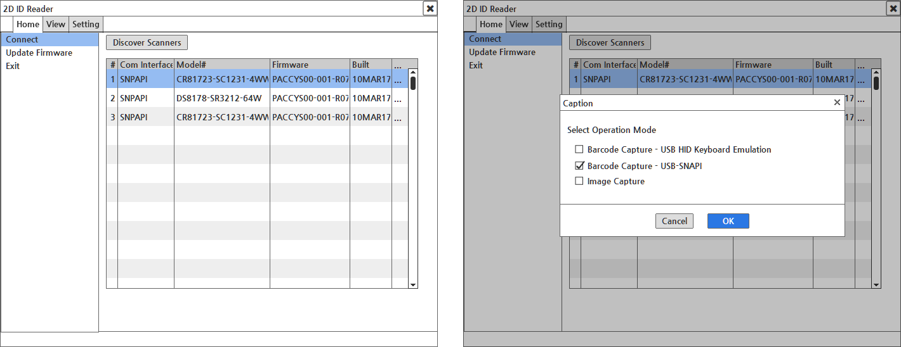
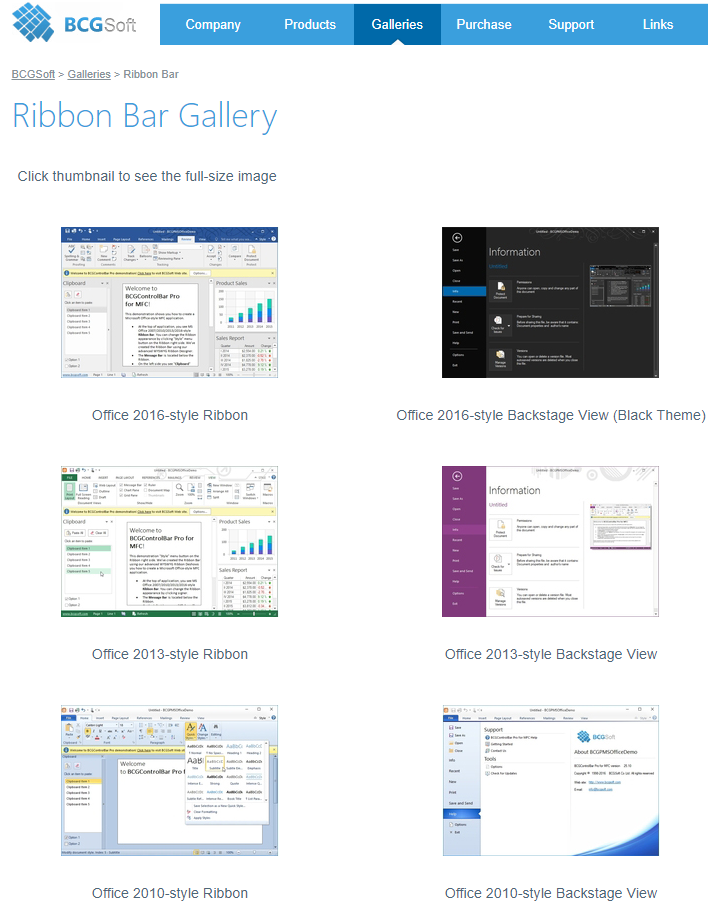
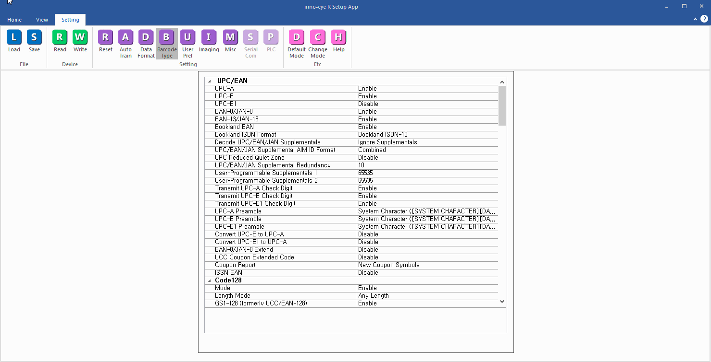
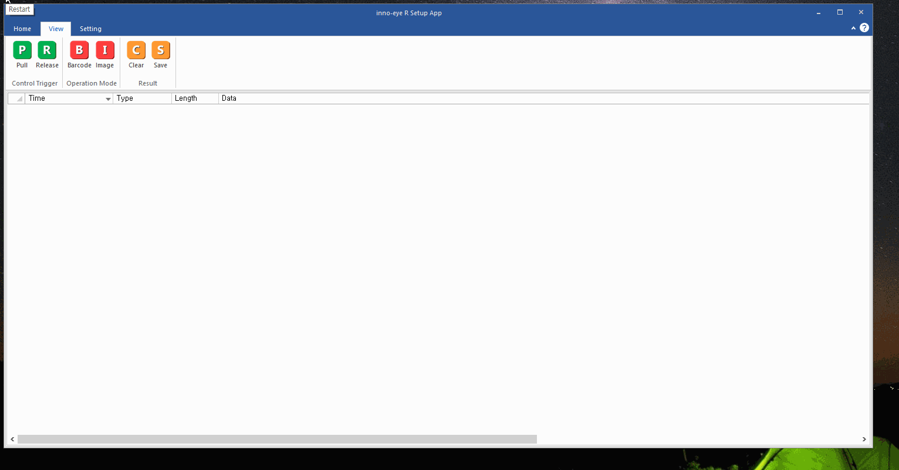
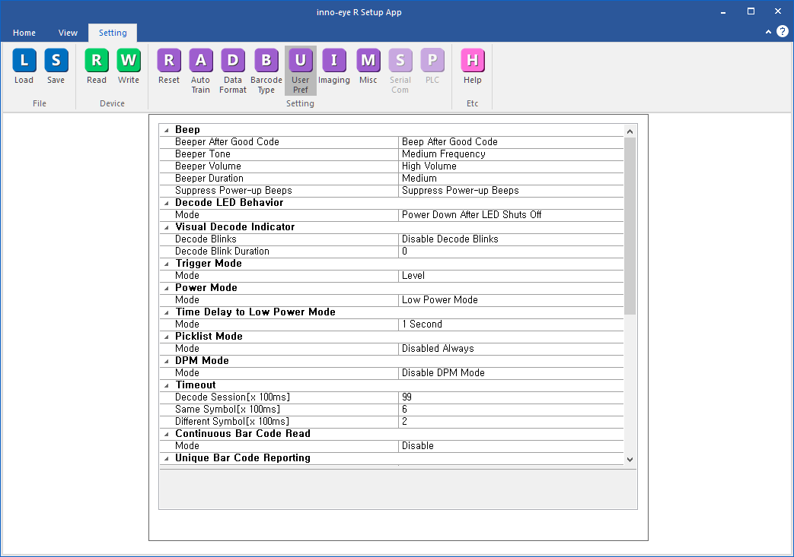

# Innoeye Code Manager 어플리케이션 개발

## 개요

동일비전 입사 후 처음 맡았던 프로젝트로, Zebra사의 바코드 하드웨어 모듈\(이하 PL3307\)이 탑재된 자사 바코드 리더기와 연동하는 어플리케이션 개발을 진행하였다.

프로젝트에서 담당했던 부분은 총 두 파트로 다음과 같다,

* 바코드 리더기와 연결하고, 동작 환경 설정 및 스캔한 영상 및 데이터를 수신하는 제어부분
* 바코드 리더기에서 수신한 영상과 데이터 출력 및  리더기 동작 설정화면 부분

## 세부내용

* 기간 :  2017.03.13 ~ 2018.02.09
* 사용언어 : C++\(MFC\)
* 사용 라이브러리
  * Zebra Scanner SDK\(Zebra 바코드 리더기 제어 라이브러리\) 
  * STL\(데이터 처리\)
  * GDI+
  * OpenCV\(이미지 프로세싱 라이브러리\)
  * BCGControlBar\(커스텀 상용 UI 라이브러리\)

## **담당파트**

### **UI 설계, 구현 및 제어 모듈 연동 작업**

이전까지 UI 구현은 전부 대화상자 기반에서 작업했었는데, 해당 프로젝트에서는 SDI 기반에서 설계 및 구현을 진행하였다.

SDI 구조를 채택한 이유는 두가지로, 첫번째는 UI 디자인 레퍼런스였던 Zebra 사 바코드 리더기 어플리케이션인 "123Scanner"의 UI가 SDI 구조였기 때문이었고, 두번째는 새로운 UI 기반에서 개발해보고자 하는 개인적인 욕심이었다.

UI 개발시 유료 UI 라이브러리인 BCGSoft사의 BCGControlBar를 사용했다. SDI 기반 개발에 참고할만한 풍부한 샘플 코드와 메뉴 디자인을 위한 UI 설계 프로그램이 제공되었기 때문이었다.

100 여개가 넘는 설정 파라메터를 손쉽게 처리 하기 위해 데이터 포멧은 XML,데이터 입출력에는 tinyXML 라이브러리를 사용하였다.

XML보다 데이터 구조를 명확하게 보이는 JSON을 택하지 않은 이유는 이전 프로젝트에서 어플리케이션 설정 파라메터를 tinyXML 라이브러리로 XML 포멧으로 처리하는 모듈을 개발한 적이 있었다. 따라서 추가 공수 없이 빠르게 해당 프로젝트에 적용 가능 했기 때문이었다.

파라메터 화면 출력은 Property Grid 컨트롤을 사용하여 구현하였는데, 다른 컨트롤에 비해 다수의 데이터를 손쉽게 입출력이 가능하고, 스핀컨트롤, 콤보박스 등 여러 종류의 컨트롤들을 파라메터의 입력타입에 따라 능동적으로 처리하고 하나의 컨트롤 안에 포함시킬 수 있었기 때문이었다.

### **PL3307 제어 모듈 개발**

PL3307에서 USB, Serial 두가지 통신모드를 지원하였기 때문에, USB는 Zebra사의 SDK를 사용하여 구현하였으며, Serial의 경우는 마찬가지로 Zebra사의 독자적 Serial 프로토콜인 SSI\(Simple Serial Interface\)를 기반으로 구현하였다.

Serial 통신쪽의 경우 통신부분은 이전 프로젝트에서 만들었었던 통신 모듈을 활용하여 개발 기간을 단축하였다. 또한 기능 확장을 위해 PL3307과 연동하여 동작하는 자체 개발한 펌웨어 탑재로, 펌웨어 통신 프토토콜 설계 업무도 같이 수행하였다.

USB 와 Serial 제어 모듈의 인터페이스가 대부분 동일하였기 때문에, 공통 인터페이스를 가지는 기본 클래스 설계한 뒤에 해당 클래스를 상속하여 각 모듈별 세부 기능을 구현하였다. 이를 통해 UI 부문과 단일 클래스로만 연동하도록 구현함에 따라 사용자가 어플리케이션 상에서 어떤 통신 모드의 바코드 리더기를 연결하여도 유연하게 처리할 수 있었다.

## 어려웠던 점

### **낯선 분야에 대한 개발의 어려움**

그동안 프로젝트를 수행하면서 처음 접해보는 분야였던 경우에라도, 내부에 해당 분야에 대한 경험자가 최소 한명 이상은 있었기 때문에 업무 수행에 크게 어려움이 없었다.

그러나 해당 프로젝트의 경우 내부에 바코드 리더기를 다뤄본 경험자가 전무했었기 때문에 제조사가 제공해준 기술문서에 의존하여 디바이스의 동작을 분석하고, 연동하는 어플리케이션을 개발 했어야만 했다.

그런데 문서도 원서인데다가 바코드와 관련한 전문용어가 많이 나와 관련 배경지식이 전무했던 당시로서는 개발에 앞서 전반적인 내용 파악하는데 어려움이 많았다.

## 정리

UI 라이브러리 사용 및 SDI 기반 UI 어플리케이션 개발을 통해 UI 개발 스킬을 강화할 수 있었다.

동일한 동작을 하는 다른 통신 모드에 대한 효과적으로 처리하기 위한 설계 및 구현 경험을 통하여 어플리케이션 구조 설계 및 개발 스킬을 강화할 수 있었다.

## 스크린샷

