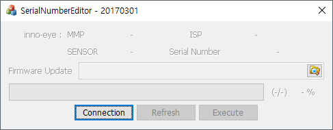
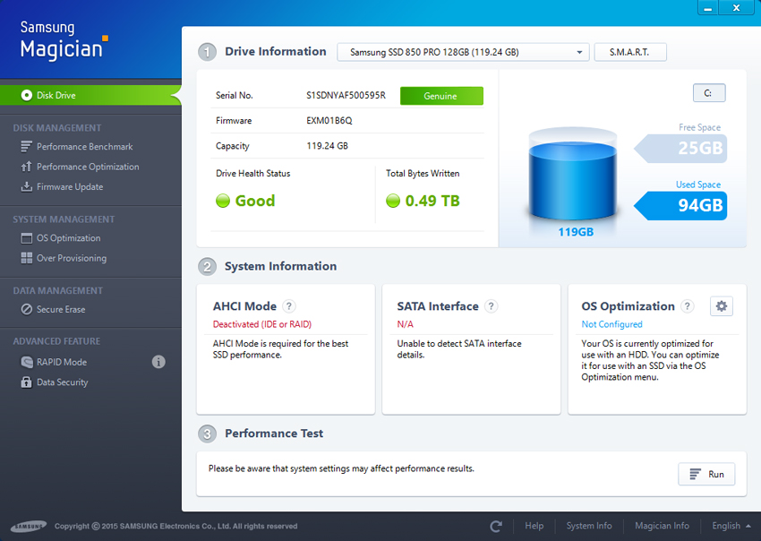
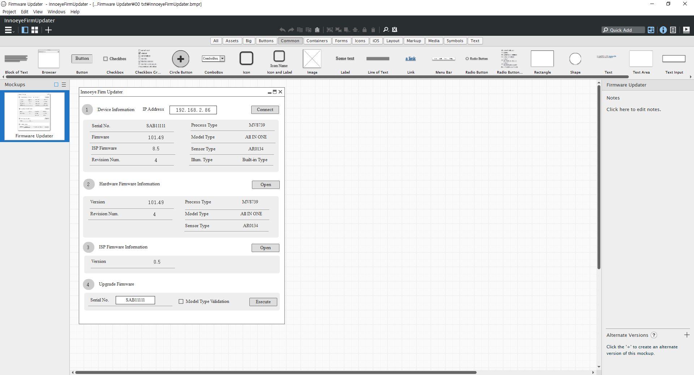
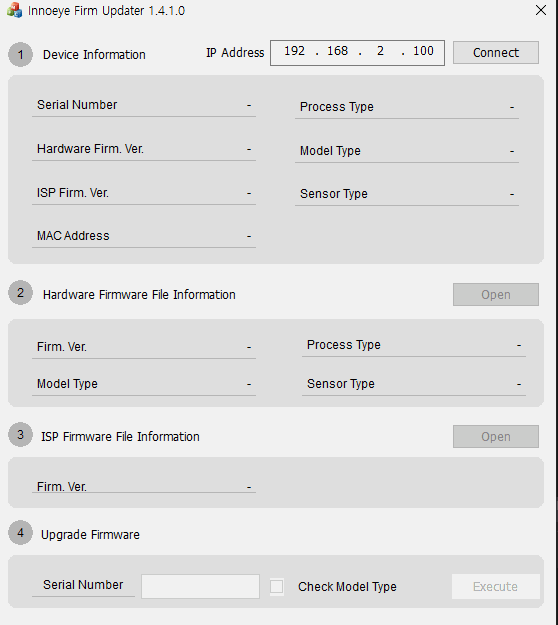

# Innoeye Firmware Updator 어플리케이션 개발

## 개요

자사 스마트 카메라\(이하 Innoeye\)에 펌웨어 업로드 가능한 기능을 지원하는 어플리케이션 개발 사이드 프로젝트였다.

이미 동일한 기능을 하는 어플리케이션이 존재했었으나, 단순히 Innoeye와 연결해서 펌웨어만 업로드 할 수 있는 기능 제공했었다.

따라서 현재 연결된 디바이스나 업로드할 펌웨어 파일의 정보 등을 확인할 수 없는 등의 불편한 부분이 있었다.

또한 업로드 중 프로그램이 다운되는 현상이 종종 발생하여 안정성 문제도 있었기 때문에 이러한 부분을 수정 및 개선하기 위한 목적도 있었다.

## 세부내용

* 기간 : 2018.07.02 ~ 2018.07.20
* 개발 언어 : C++\(MFC\)
* 사용라이브러리 
  * innoeye Vision Manager 프로젝트시 개발 제어 모듈
  * UI 오픈 소스 라이브러리

## **담당파트**

### **UI 설계 및 개발**

UI 설계시 사용자가 업로드할 디바이스와 펌웨어의 정보를 한눈에 볼 수 있었으면 좋겠다는 요구사항이 있었다.

이에 요구사항을 최대한 반영하기 위해 가장 부합되는 디자인을 구글링을 통해 다양한 어플리케이션 디자인 리서치 하여 'Samsung Magician'\(삼성 SSD 파티션 어플리케이션\)을 디자인 레퍼런스로 선정 하였다.

개발 전, UI 목업 제작 어플리케이션 툴인 'Balsamiq'을 사용하여, 레이아웃 및 동작 시나리오를 검증하였다.

UI 화면 개발시 기존 어플리케이션과 디자인적으로 차별화를 주기 위해 MFC 기본 컨트롤을 사용하는 대신 Innoeye Vision Manager 프로젝트 UI 개발 코드를 일부 활용하였다.

### **UI와 제어 모듈간 연동**

Innoeye Vision Manager 프로젝트시 이미 연동 작업을 수행한 경험이 있었고, 해당 어플리케이션 비하면 사용자 조작에 따른 UI상 처리해야 할 부분들이 적었기 때문에 작업을 진행하는데 크게 문제가 없었다.

## 어려웠던 점

### **MFC 프레임워크상 디자인한 UI 구현 한계**

inno-eye Vision Manager 프로젝트에서도 겪었던 문제이긴 한데, MFC 프레임워크상의 한계인지는 몰라도 프로그램 화면에 보이는 UI와 디자인 툴로 작성한 것과의 차이를 줄이는 부분이 많이 어려웠었다.

이를테면 다이얼로그 배경으로 각 꼭지점에 R이 들어간 사각형 출력시, R값을 아무리 크게 주어도, 디자인 툴에서 보이는 것만큼 꼭지점 부분이 스무스한 사각형을 만들기 어려웠다. 구글 검색을 통해서 찾은 방법\(사각형을 먼저 그리고, 각 꼭지점에 맞는 작은 원을 그리는 식\)도 적용해보았으나, 기존 방식과 별로 차이가 없었다.

UI의 디테일한 부분도 이번 프로젝트에서 중요한 부분으로 생각했었다.

하지만 전체적인 어플리케이션 개발에서 봤을 때는 중요도가 낮은 부분으로 무작정 시간을 쏟을 수도 없는 상황이었기 때문에 가능한 범위 내에서 최대한 유사하게 보일수 있도록 구현하는 선에서 마무리를 지었다.

## 정리

이전 프로젝트를 수행하며 익혔던 기술을 다음 프로젝트에서 활용함으로써 해당 스킬에 대한 전문성을 업그레이드할 수 있었다.

### 스크린샷

