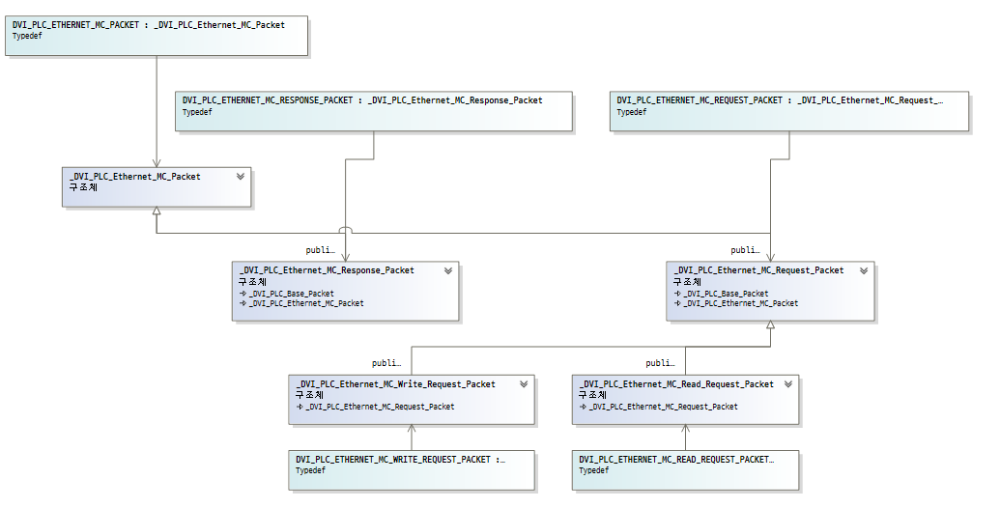

# Innoeye Vision Manager For PC 어플리케이션 서브 컴퍼넌트 개발

## 개요

다수의 산업용 카메라와 연동하여 동작하는 PC 기반 머신 비전 시스템과 연동하는 서브 컴퍼넌트 개발 프로젝트였다.

시리얼 및 이더넷 기반 PLC\(Programmable Logic Controller\) 장치와 연동하여 동작하는 통신 모듈과 함께 AAEON社 Ultra Slim PC 내장형 디지털 입출력 보드 제어 모듈과 기존 고속 입출력 디지털 신호 처리 모듈과의 연동 부분을 맡아 개발 업무를 진행하였다.

또한, 메인 어플리케이션 상에서 신규 개발된 기존 메인 시스템과 연동을 위한 PLC 통신 모듈 설정 UI 개발도 함께 진행하였다.

## 세부내용

* 기간 : 2020.02.06 ~ 2020.03.27
* 개발 언어 : C++\(MFC\)
* 사용 라이브러리 
  * CoreBase\(문자열 처리 자체 개발 라이브러리\)
  * CoreSerial\(시리얼 통신 자체 개발 라이브러리\)
  * CoreEhternet\(이더넷 통신 자체 개발 라이브러리\)
  * AAEON HiSafe\(AAEON 디지털 입출력 장치 제어 라이브러리\)
  * JsonCpp\(Json 포맷 설정파일 처리 라이브러리\)

## **담당 파트**

### **멀티 프로토콜 서포트 PLC 컨트롤 모듈 개발**

PLC는 Programmable Logic Controller의 약자로 공장 자동화 라인에서 스마트 카메라나 감지 센서 등 다양한 기기들과 연동하여 제어 및 모니터링에 사용하는 제어 장치이다.

즉, 연결된 외부장치로부터 받은 입력을 프로그램에 의해 순차적으로 논리 처리하고 그 출력 결과를 이용해 다시 연결된 다른 외부장치를 제어한다.

특히 PLC 도입 이전 공장 자동화 라인에서는 PCB 기판에 릴레이 회로를 구성하여 구축하였는데, 생산 설비 상황에 따라 프로세스가 변경되는 경우 기판을 새로 제작하여 설치하는 등의 불편함이 있었다.

하지만 PLC는 이러한 프로세스를 프로그래밍하듯 코드를 작성하여 운용할 수 있어서 초기 셋업때와 상황이 달라질 때에도 유연하게 대처할 수 있다.

따라서 현재와 같이 복잡하고 대규모의 공장설비를 구축. 운영하는 데 있어 머신 비전 시스템과 함께 없어서는 안 될 구성이라고 볼 수 있다.

그래서 이번 프로젝트에서 가장 비중을 두어 개발을 진행했던 부분이기도 하다.

이번 프로젝트에서 LS산전, 옴론 등 10여 개가 넘는 회사에서 취급하고 있는 PLC 중 실제 현장에서 가장 많이 쓰이고 있는 LS산전과 미츠비시를 대상으로 개발을 진행했으며, 제조사별로 선정했던 프로토콜은 다음과 같다.

* LS산전 : XGT\(Serial, Ethernet\), ModbusTCP\(Ethernet\)
* 미츠비시: MC\(Ethernet\) , NonProcdure\(Serial\) 

모듈 기획 단계에서 다양한 프로토콜의 동작 및 통신 인터페이스를 아우르면서, 외부와는 단일 모듈로 연동할 수 있도록 디자인 패턴 중 하나인 MVC 패턴을 사용하였다.

상기 그림은 개발했던 프로토콜 중 미츠비시社의 Ethernet MC 프로토콜로, 이름에서 알 수 있다시피 이더넷 기반으로 동작하는 프로토콜이다.

여기에서 실제 디바이스와 통신을 담당하는 컨트롤러에서 사용할 기반 데이터 모델인 DVI\_PLC\_Base\_Packet에서는 공통을 사용할 기능과 구조를 정의하였고, 나머지 실제 PLC 프로토콜 데이터를 만들고, 파싱하는 부분은 DVI\_PLC\_Base\_Packet을 상속받은 세부 구조체\(여기서는 DVI\_PLC\_ETHERNET\_MC\_PACKET\)에서 정의, 구현하였다.

컨트롤러 모델은 통신 인터페이스에 따라 시리얼 통신 클래스인 CoreSerialController를 부모 클래스로 둔 CPLCSerialController와 이더넷 통신 클래스인 CoreEthernetEvent를 부모 클래스로 둔 CPLCEthernet로 정의하였다.

다만 프로토콜별 공통 기능 및 로직을 CoreSerialController와 CoreEthernetEvent의 상위 클래스로 두는 건 설계에 맞지 않았기 때문에 이를 담당할 CPLCBaseController 클래스를 정의하여 상속받도록 설계하였다.

그 결과 CLSISSerialXGTController, CMitsubishiNonProcedureController 등 세부 컨트롤러 모델 클래스에는 프로토콜별 독립적으로 사용하는 기능들만 구현하도록 설계할 수 있었다.

이처럼 정의한 프로토콜 데이터 모델과 컨트롤러 모델 간의 의존성을 최소화하여 시리얼 통신환경에서 LS산전社의 이더넷 통신 프로토콜인 XGT Ethernet 데이터 모델과 미츠비시社의 EthernetMC 컨트롤러 모델처럼 동작하는 극단적인 컨트롤러를 정의하는 일도 가능해질 수 있었다.

따라서 정의된 프로토콜의 데이터 모델과 컨트롤러 모델 클래스 구조를 따라 구현만 하면 바로 메인 시스템과 연동하여 동작할 수 있도록 구성하였기 때문에 이후 프로토콜 추가 개발 시에도 신속하게 적용할 수 있게 되었다.

또한, 이번 프로젝트에서는 그동안 책을 통해서 글로만 익혔던 단위테스트를 적용하여 개발 업무를 수행하였다.

단위 테스트를 적용한 계기는 구현한 프로토콜별 데이터 모델이 문서에 기술된 데로 정상적으로 데이터 생성하고, 파싱하는지에 대한 확인이 필요했었는데, 실제 연동을 통해 검증하기에는 디바이스가 제 때 수급이 되지 않아 현실적으로 불가능했다.

따라서 프로토콜별 명세에 따라 생성된 더미 데이터를 단위테스트를 이용하여 개발을 진행하였고, 그 결과 정해진 일정에 큰 지연 없이 무사히 개발을 끝마칠 수 있었다.

### **AAEON社 Ultra Slim PC 내장형 디지털 입출력 보드 제어 모듈 개발**

이번 프로젝트의 또 다른 목표 중 하나는 다양한 자동화 생산 설비에 활용할 수 있도록 현재 비전 시스템에서 지원하는 디지털 입출력 보드의 가짓수를 늘리는 것이었다.

이러한 목표를 기준으로 추가 보드 구입 없이 바로 디지털 입출력 기능을 활용 가능한 AAEON社의 Ultra Slim PC 내장형 디지털 입출력 보드를 선정하였다.

해당 모듈 개발 시 디바이스 제어 부분과 함께 메인 모듈인 고속 디지털 신호 입출력 모듈과 연동 부분은 이전 프로젝트의 EMUI 보드 제어 모듈에서 미리 구현해놓은 구조와 인터페이스를 참고하여 구현하였다.

또한, 이번 제어 모듈을 개발을 통해 기존 EMUI 보드 제어 모듈 개발 시 아쉬웠던 부분이었던 추가 모듈 지원을 고려하여 상위 클래스에서 공통으로 사용할 부분과 아닌 부분에 대한 구분을 보다 명확하게 정의할 수 있었다.

그 결과 처음 모듈 설계 시 놓쳤었던 부분을 보완할 수 있었기 때문에 보다 확장성을 고려한 유연한 모듈 구조를 가지도록 설계할 수 있었다.

## 어려웠던 점

### **담당 분야에 대한 서포트 인력 부재로 인한 개발의 어려움**

지금까지 수행해온 프로젝트들이 대부분 새로운 분야에 대해서 진행하는 경우가 많았는데, 해당 분야에 대해 개발할 때마다 제반 지식을 쌓고 이를 개발에 응용하는 것은 현실적으로 불가능하므로, 이를 보완해줄 전문 인력의 지원이 무엇보다 중요하다.

예를 들어 "이노시뮬레이션"에서 개발했었던 "모션 플랫폼 시트 제어 어플리케이션"의 경우, 모션 시트를 프로그래밍 적으로 제어하기 위해선 "역기구학"\(Inverse Kinematics\)" 알고리즘이 필요했었는데, 당시 이 부분은 제어계측공학"을 전공한 전문 인력이 담당하여 초기 기획 단계부터 개발, 검증까지 전 과정에 걸쳐 함께 수행했었기 때문에 프로젝트를 큰 일정 지연 없이 신속하고 성공적으로 끝낼 수 있었다.

하지만 이번 프로젝트에서는 내부 지원 없이 제조사의 공식 메뉴얼이나 구글 검색 및 관련 개발자 커뮤니티에 질문을 통해 혼자 개발, 검증을 진행해야 했기 때문에 많은 어려움이 있었다.

## 정리

모듈 설계부터 구현, 검증까지 전반적인 개발업무를 지원 인력 없이 단독으로 담당하여 수행하다 보니 크고 작은 어려움은 있었지만, 그동안 책으로만 익혔었던 단위테스트를 실제 프로젝트에 적용해 볼 수 있었기 때문에 개인적으로는 큰 의미가 있었던 프로젝트였다.

