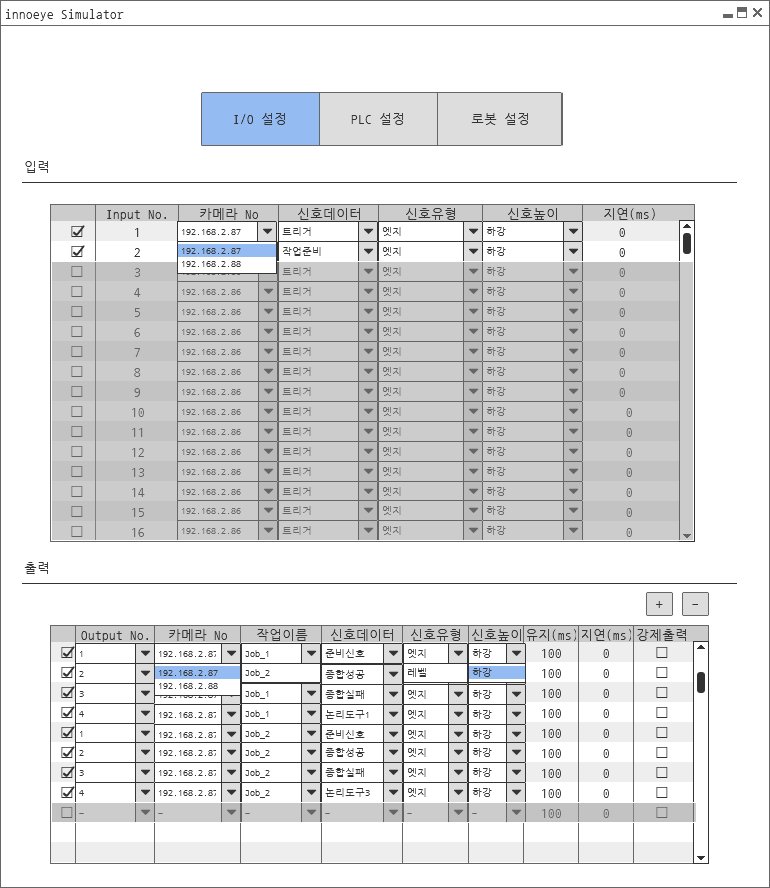
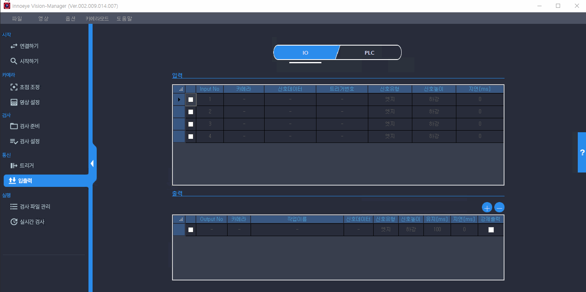
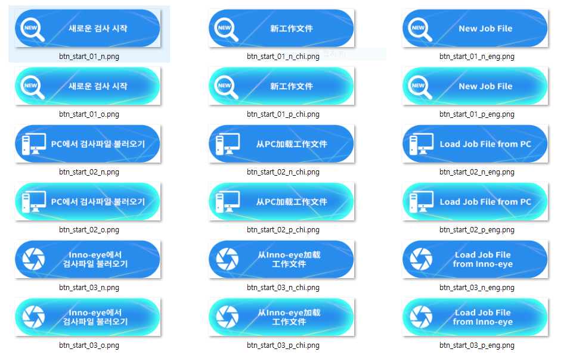
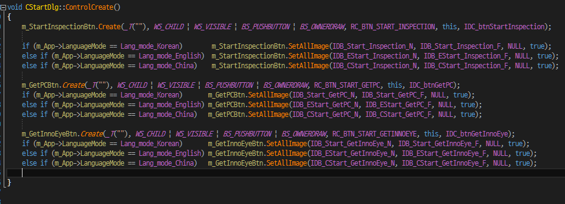
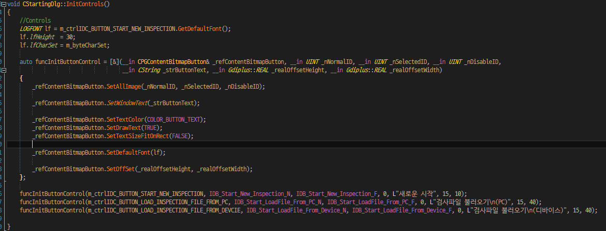
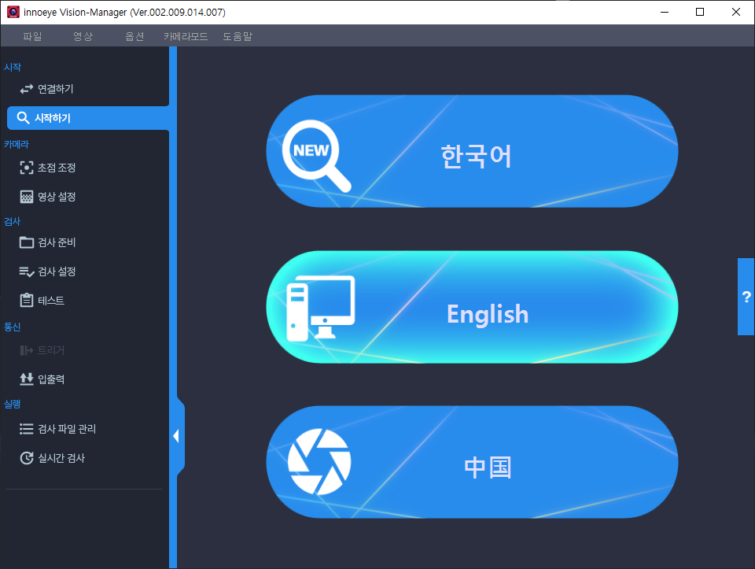

# Innoeye Vision Manager For PC 어플리케이션 개발

## 개요

여러 대의 산업용 카메라에서 촬영된 이미지들을 기반으로 비전 검사를 수행하는 PC 기반 머신 비전 시스템 개발 프로젝트였다.

기존 자사 스마트 머신 비전 카메라의 하드웨어 성능 한계로 할 수 없었던 고해상도 영상 기반 고속 비전 검사 분야에 대응하기 위함이었다.

산업용 카메라\(Area Scan 타입, Basler 社\), 디지털 입출력 처리 보드\(Innodisk社\)기반 고속 입출력 신호 처리 및 이를 아우르는 머신 비전 시스템 아키텍처 등 어플리케이션 전반에 걸쳐 설계 및 개발 업무를 담당하였다.

또한, 어플리케이션 개발도 담당 하였는데 이전 프로젝트에서 개발 했었던 UI 어플리케이션 및 UI 컴퍼넌트를 활용하여 개발 기간을 단축시킬수 있었다.

## 세부내용

* 기간 : 2019.01.07 ~ 2019.08.30
* 개발 언어 : C++\(MFC\)
* 사용 라이브러리 
  * CoreBase\(문자열 처리 자체 개발 라이브러리\)
  * CoreCV\(OpenCV 기반 이미지 프로세싱 자체 개발 라이브러리\) 
  * STL\(데이터 처리\) 
  * OpenCV\(이미지 프로세싱 라이브러리\)
  * Pylon SDK\(Basler 카메라 제어 라이브러리\)
  * JsonCpp\(Json 포맷 설정파일 처리 라\)
  * GDI+
  * BCGControlBar \(커스텀 UI 상용 라이브러리\)
  * UI 오픈소스 라이브러리

## **담당파트**

### **JsonCpp 라이브러리를 이용한 모듈, 어플리케이션 환경 설정 파라메터 Json Serializer & Deserialer 모듈 개발**

이전 프로젝트까지는 모듈 및 어플리케이션의 환경 설정 파라메터를 INI 파일로 저장하고 불러와서 적용하는 방식을 사용했었다.

그런데 해당 프로젝트에서는 모듈 및 어플리케이션의 환경 설정 파라메터 개수가 늘어나고, 단일 설정 파일로 관리가 되었음 하는 요구사항 때문에 복잡한 구조를 가지게 되면서 기존 방식으로는 처리할 수가 없었다.

따라서 여러 모듈의 파라메터를 한 파일에서 포함된 복잡한 구조를 다루는데 INI보다 JSON이 더 적합하다고 판단 JsonCpp 를 이용한 환경 설정 파일 모듈을 개발하였다.

이를 통해 상황에 따라 모듈별 환경 설정 파라메터를 하나의 파일 혹은 각각 파일로 저장하여 사용할 수 있게 됨으로써 상황에 따라 유연하게 설정 파일 정책을 가져갈 수 있게 되는 성과를 얻을 수 있었다.

### **산업용 카메라 제어 모듈 설계 및 구현**

Basler사의 산업용 카메라 SDK인 Pylon을 이용하여 개발하였으며, 모듈의 기본 구조는 SDK에 포함된 MFC 어플리케이션 예제를 참조하여 설계하였다.

GigE 표준 카메라 인터페이스를 지원하였기 때문에 추후 타사 GigE 카메라 연동을 고려하여 공통 인터페이스 부분에 대하여서 추상화 클래스를 고려하여 설계 및 구현하였다.

### **고속 디지털 입출력 신호 처리 모듈 설계 및 구현**

카메라와 외부 입출력 신호 처리를 수행하는 디지털 입출력 보드는 innodisk사의 디지털 IO 보드인 EMUI-0D01을 사용하였다.

타사 제품보다 가격 측면의 부분에서의 경쟁력뿐만 아니라 최대 지원 입출력포트가 32개로 최대 4대의 카메라로 구성된 멀티 카메라 검사 환경에서 카메라별로 각각 4개의 입출력포트를 가져야 한다는 요구사항을 충족하는 유일한 제품이었기 때문이었다.

모듈 설계 시 스마트 카메라의 입출력 처리 모듈과 동일하게 동작해야 한다는 요구사항에 따라 입출력포트별 지연, 유지 시간 개념이 반영되었다.

또한, 이후 비용 혹은 또 다른 문제로 다른 하드웨어로 교체될 가능성도 고려하여 활성 포트에 대한 지연, 유지시간 처리 등 같은 응용 기능들은 상위 모듈 클래스에서, 포트 설정 및 활성화 같이 디바이스를 실제로 제어하는 부분은 하위 세부 클래스에서 동작하도록 구현하였다.

### **머신 비전 시스템 아키텍처 설계 및 구현**

멀티 카메라 운용 방식은 이전 스마트 카메라 비전 시스템과 유사하였기 때문에 이를 참고하여 개발하였다.

다만 이전 스마트 카메라 비전 시스템과 다르게 UI 화면과 관련 있는 부분을 UI 쪽이 아닌 시스템 쪽에서 구현하였다는 점이다.

이를테면 화면에 있는 현재 연결 가능한 카메라들에 대한 정보를 담고 있는 그리드 리스트 컨트롤에 관련 정보를 디스플레이 하는 부분에 대해서 이전에서는 UI 구현 부에서 시스템 모듈에서 정보를 가져와 처리했다고 하면, 이번 프로젝트에서는 시스템 모듈에 컨트롤을 입력 인자로 받아 처리하도록 변경하였다.

그 결과 해당 화면뿐만 아니라 이와 유사한 화면 UI 구현 시 코드 작성량 또한 줄였을 뿐만 아니라 이후 컨셉 변경에 대한 코드 수정 또한 유연하게 대처할 수 있었다.

### **어플리케이션 UI 화면 설계 및 구현**

일부 어플리케이션 UI 화면은 해당 프로젝트의 요구사항과 맞지 않아 새로 설계 및 구현하였다.

이를테면 입출력 신호 설정 화면이 그 대표적인 예로 입출력 설정 인터페이스로 단일 스마트 카메라에 대하여 설정 가능했던 이전 프로젝트와 달리 여러 카메라를 설정할 수 있어야 했다.

따라서 이러한 요구사항이 반영된 화면에 맞는 커스텀 컨트롤을 새로 만들어 구현하였다.

요구사항을 고려한 화면 구성 및 동작 시나리오 검증을 위해 UI 와이어 프레임 툴인 `balsamiq` 을 활용하였다.

### **커스텀 UI 컨트롤 내부 코드 개선**

이전 프로젝트의 어플리케이션에서 라운드 바 컨트롤이 포함된 화면에 해당 컨트롤에 안티 얼라이싱이 적용되지 않아 양 끝 부분이 거칠게 보이는 문제가 있었다.

이번 프로젝트에서는 컨트롤 그리기 코드를 수정하여 양 끝단이 매끄럽게 보일 수 있도록 개선하였다.

### **다국어 지원을 위한 커스텀 UI 컨트롤 구현**

이전 프로젝트에서 UI 코드 중 아쉬웠던 부분 중 하나가 텍스트와 이미지가 함께 있는 버튼 컨트롤의 다국어 처리였다.

기존 어플리케이션에 지원되는 언어인 한, 영, 중문 처리를 위해 각 버튼마다 언어별로 Normal, Focus, Disable 이미지가 각각 3개씩 총 9개가 필요했었다.

따라서 지원 언어가 추가되는 경우 버튼 이미지 제작은 물론 코드도 추가로 구현해야 하는 문제가 있었다.

따라서 언어별로 이미지상에서 공통으로 쓰는 부분만 남기고, 텍스트 출력 부분은 코드로 처리할 수 있도록 변경하였다.

그 결과 버튼 컨트롤의 이미지 리소스 갯수는 1/3로 줄이고, 구현해야할 코드량도 줄이는 성과를 얻을 수 있었다.

### **멀티 타입 컨트롤 지원 가능한 커스텀 그리드 리스트 컨트롤 개발**

체크 박스, 콤보박스, 스핀 컨트롤 등 여러 타입의 컨트롤이 포함된 그리드 리스트 컨트롤을 개발하였다.

상용 라이브러리인 BCGControlBar 에서 제공하는 그리드 컨트롤 기반으로 개발하였으며, 요구사항에 없는 기능들은 직접 구현하였다.

이를테면 스핀 컨트롤이 포함한 에디트 컨트롤에서 에디트 박스에 입력한 값에 대한 범위 처리 부분이나 콤보박스 변경에 따른 그리드 리스트의 다른 컨트롤에 대한 유효성 체크 등 같은 부분이 그 대표적인 예라고 할 수 있겠다.

## 어려웠던 점

### **설계 및 구현 난도가 높았던 고속 디지털 입출력 모듈**

프로젝트에서 맡았던 부분 중 입출력 모듈 설계 및 개발에 가장 많은 시간이 소요되었었다.

그 이유는 PC 기반 머신 비전 시스템과 스마트 카메라 비전 시스템 간의 구조적 차이 때문이었다. 다시 말해 스마트 카메라의 입출력 모듈의 경우 해당 모듈과 카메라 제어, 비전 검사 모듈이 일 대 일로 연동하여 동작하는 구조였다.

그런데 PC 기반의 머신 비전 시스템에서는 하나의 입출력 모듈이 다수의 카메라 제어, 비전 검사 모듈과 연동하여 동작하는 일 대 다 구조였기 때문에 모듈에서 고려해야 할 부분이 많았다.

또한, 입출력 포트 처리에 대한 컨셉도 달랐다.

이는 지원하는 입출력 포트 수도 차이 때문이었는데, 스마트 카메라의 경우 지원하는 입출력포트가 최대 다섯 개였기 때문에 해당 모듈에서 포트 개수만큼 스레드를 생성하고, 각 스레드 내부에서 Sleep 함수를 이용하여 지연과 유지 시간에 대한 동작을 구현하였었다.

하지만 PC 기반의 비전 검사 시스템의 디지털 IO 보드는 최대 지원 가능한 입출력 포트가 32개로 스마트 카메라보다 6배나 많았다.

동일하게 구현할 경우 최대 32개의 스레드를 생성되는데 아무리 스마트 카메라보다 하드웨어적 성능이 뛰어난 PC 기반이라도 부담이 될 수밖에 없었다.

또한, 카메라에서 촬영된 고해상도 이미지를 수신하고, 비전 검사를 위한 이미지 프로세싱 및 비전 검사 수행 등 여러 프로세스에 대한 동작도 고려해야 했기 때문에 스마트 카메라의 모듈 구조를 그대로 차용하는데 문제가 있었다.

그래서 외부 신호가 감지된 입력포트와 검사 모듈과 연동하여 동작할 출력포트들같이 처리해야 할 포트들에 대하여 생성시간 정보를 추가하여 스레드에서 매 순간 발생한 입출력포트의 생성시간을 기준으로 경과시간을 계산하여 처리하도록 설계하였다.

그 결과 처리할 입력, 출력 포트의 경과시간을 체크하여 처리하는 스레드 각각 하나. 외부 입력 신호에 대한 감지를 위해 폴링 타입으로 동작하는 스레드 하나. 총 3개의 스레드로 최대 32개의 스레드를 써야 했던 기존 스마트 카메라의 구조보다 더 적은 스레드로 같은 동작 하는 더욱 개선된 구조의 모듈을 개발할 수 있었다.

## 정리

프로젝트 기간 단축을 위해 이전 프로젝트의 UI 코드를 차용함에 따라 UI 프레임워크 구조 및 코드 개선을 작업을 진행할 수 있었는데, 이를 통해 개선한 프레임 워크를 이전 프로젝트에도 적용하여 두 프로젝트의 코드 품질을 동시에 높일 수 있었다.

더불어, 다소 난도가 있었던 고속 디지털 입출력 신호 처리 모듈 및 UI 커스텀 컨트롤 설계 및 개발을 통해 모듈은 물론 커스텀 UI 컨트롤 개발 역량 또한 향상 시킬 수 있었다.

