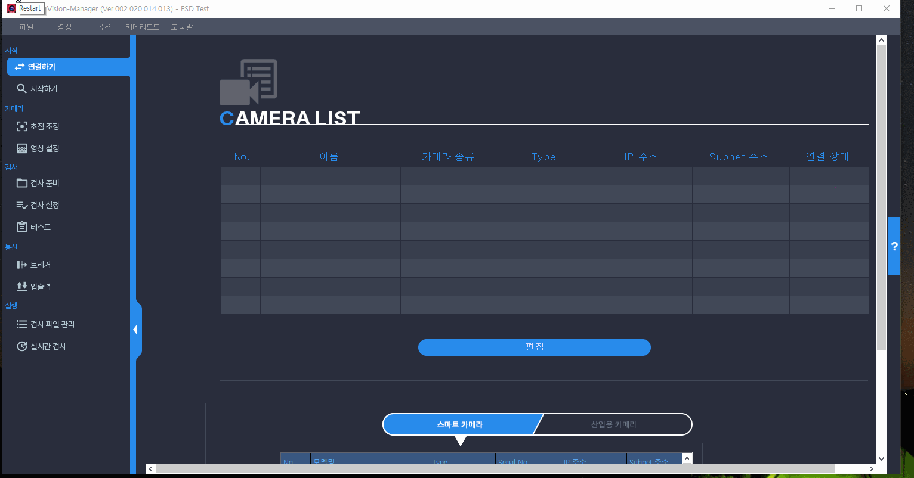
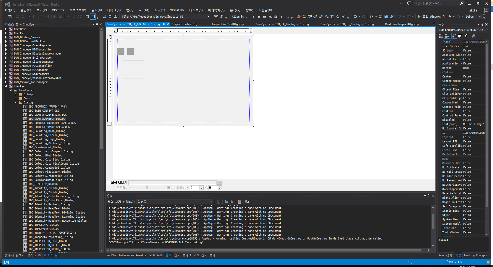
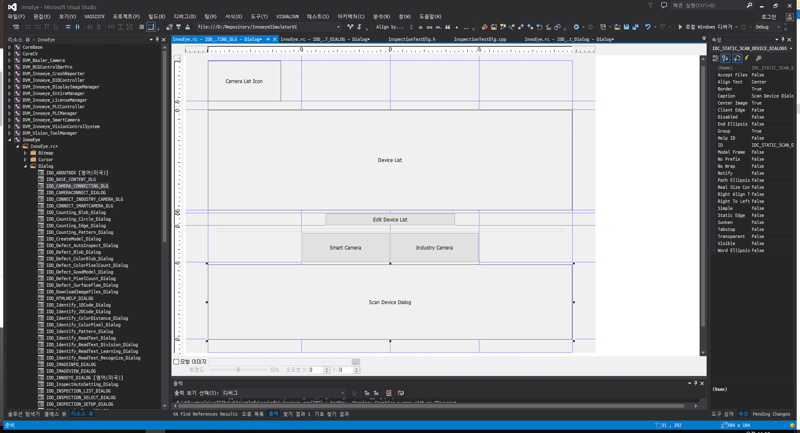
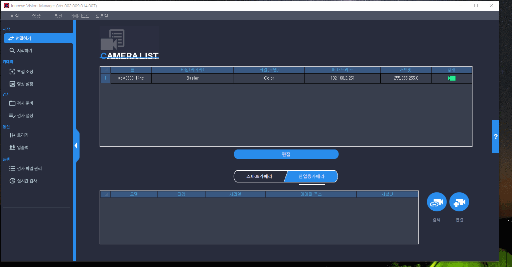
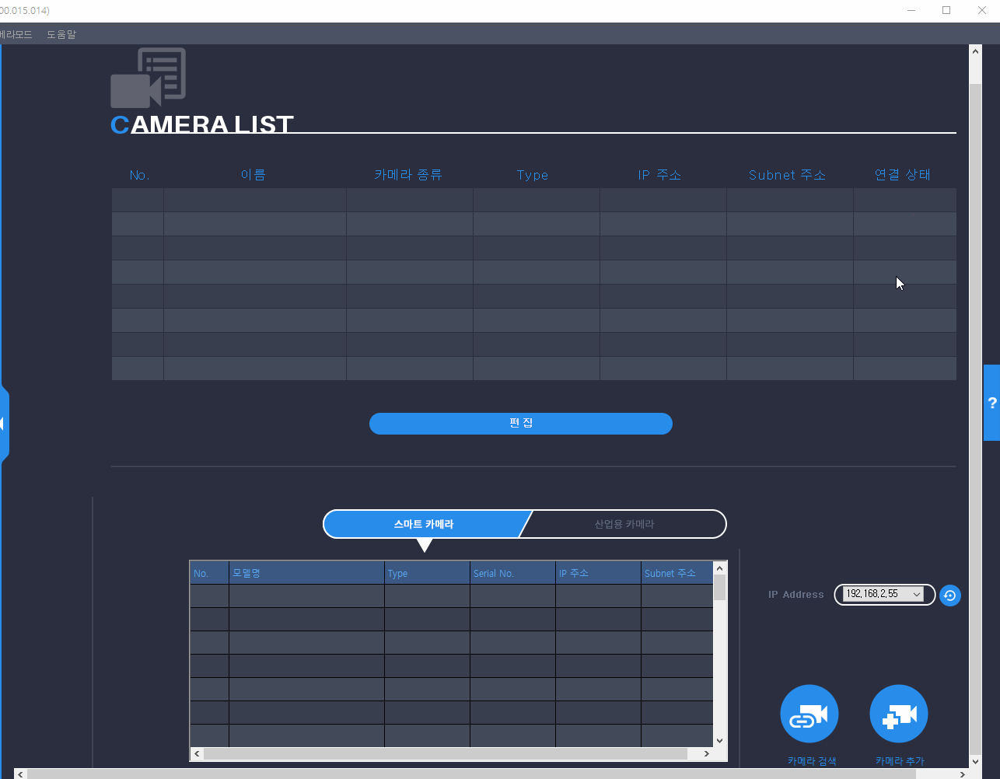
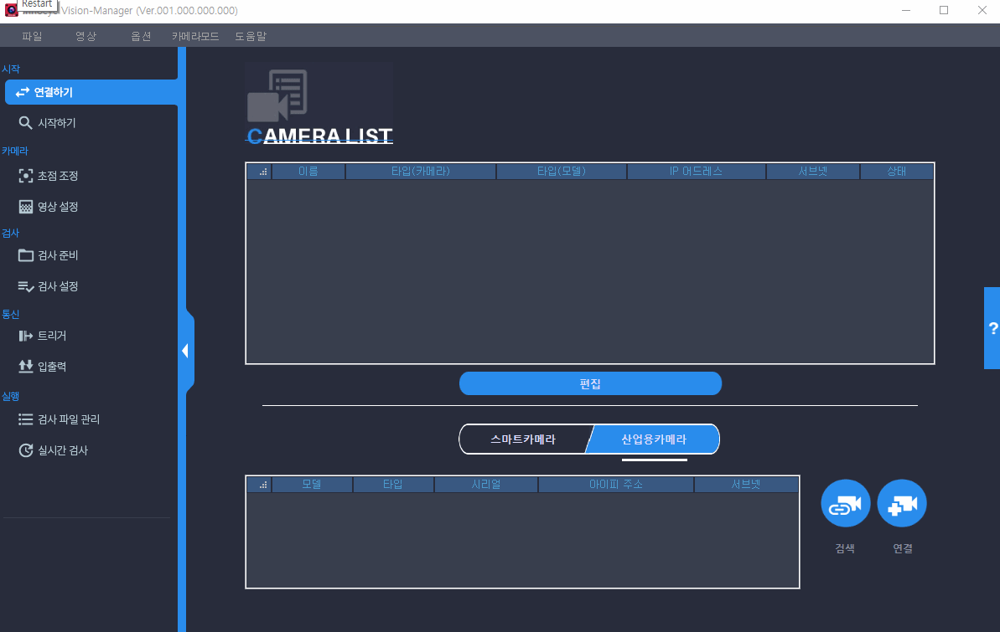
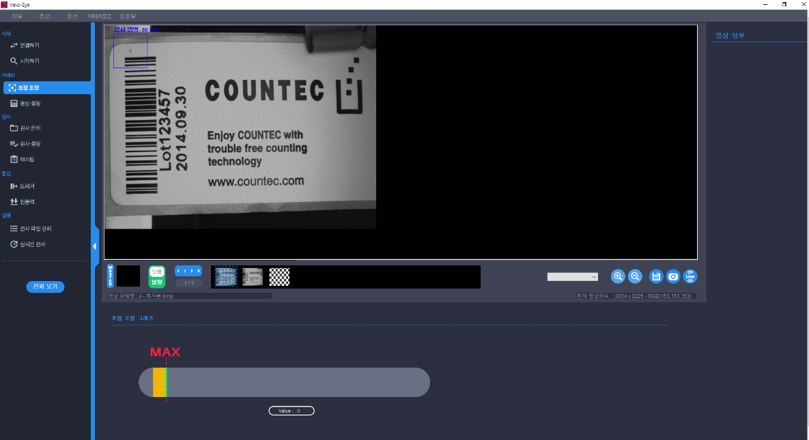
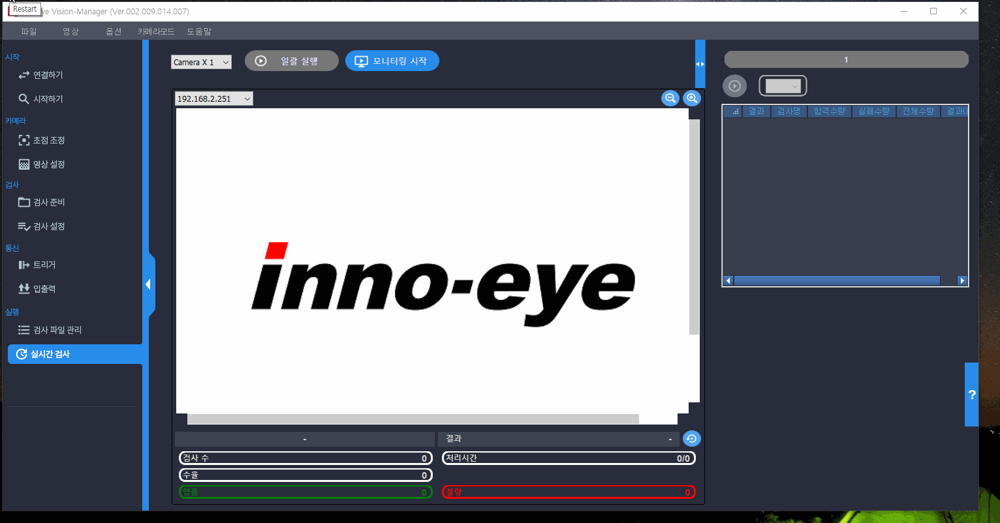

# Innoeye Vision Manager 어플리케이션 개발

## 개요

자사에서 개발한 1세대 머신 비전용 스마트 카메라\(Innoeye\) 하드웨어 성능 개선에 맞춘 기존 스마트 카메라용 어플리케이션 리뉴얼 프로젝트였다.

기존 어플리케이션에서 사용중 불편사항 및 개선사항 등을 반영하였으며, 사용자 편의성 및 심미성을 높이기 위해 UI 파트는 외주 전문 업체에 의뢰하여 진행하였다.

## 세부내용

* 기간 : 2017.12.01 ~ 2018.12.31
* 개발 언어 : C++\(MFC\)
* 사용 라이브러리 
  * CoreBase\(문자열 처리 자체 개발 라이브러리\)
  * CoreEthernet\(이더넷 통신 자체 개발 라이브러리\)
  * STL\(데이터 처리\)
  * OpenCV\(이미지 프로세싱 라이브러리\) 
  * GDI+
  * CImage\(이미지 프로세싱 오픈 소스 라이브러리\)
  * BCGControlBar\(커스텀 상용 UI 라이브러리\) 
  * UI 오픈소스 라이브러리

## **담당파트**

### **외주 개발한 UI 코드 리펙토링 및 사용성 개선**

사내에 전문 UI 디자이너의 부재와 개발인원의 부족에 따라외주 전문업체에 의뢰하여 진행하였다.

전달받은 산출물을 기본 구조를 제외한 나머지 부분에 대한 리펙토링 및 사용성 부분 개선 작업을 추가로 진행했었는데 그 이유는 다음과 같다.

#### **여러곳에 산재되어 구현된 동일한 코드들**

화면 내 배치된 컨트롤들의 리사이징 처리나 특정 키 입력에 따른 다이얼로그 종료\(**MFC 다이얼로그 클래스는 Enter, ESC 키 입력시 포커스된 다이얼로그가 자동으로 종료된다**\) 처리 무시 등 각 화면 클래스에서 공통적으로 동작하는 기능에 대한 코드들이 개별적으로 구현되어 있었다.

그래서 수정 사항 발생시 각 화면 클래스 코드들에서 해당하는 부분을 찾아 일일히 수정해야 했기 때문에 유지보수에 어려움이 있었다.

따라서 각 화면에서 기본적으로 필요한 기능들을 정리하여, 공통 기능이 포함된 기반 클래스를 만들고, 이를 각 화면 클래스에서 상속받는 구조로 변경하였다.

그 결과 기존에 비해 유지보수가 한결 편해졌음은 물론 각 화면 클래스에서는 세부적으로 필요한 기능만 구현함으로써 코드의 양 또한 줄일 수 있었다.

#### **배경 이미지에 전적으로 의존한 화면 구현**

사용자에게 현재 연결된 디바이스 정보를 리스트로 보여주는 화면이 있었는데, 리스트의 헤더에 표시될 세부 항목 텍스트 및 리스트의 레이아웃이 포함된 배경 이미지를 사용하여 구현되어 있었다.

이로인해 특정 해상도\(1920X1080\) 이하에서나 리사이징시 화면의 내용을 확인하려면 스크롤을 하여 확인해야 하는 불편함이 있었다.

그리고 화면에 출력되는 컨트롤의 배치를 리소스뷰가 아닌 코드상에서 구현되어 있어서 프로그램 실행전까지는 화면에 어떻게 보이는지 확인이 어려운 문제가 있었다.

따라서 프로그램을 실행하지 않고도 각 화면의 배치를 확인할 수 있도록 리소스 뷰에서 모든 컨트롤들을 배치하고, 화면 내에서 구분되어 보여야 할 영역에 대해서는 분리하여 처리하였다.

또한 구현한 리사이징 기능을 적용하여 화면의 전체 컨트롤들이 화면 해상도에 상관없이 전부 디스플레이 되도록 하였다.

#### **직관성이 낮은 화면 UI**

일부 화면 UI의 경우 직관성이 떨어져 사용자에게 모호함을 주기도 했었는데, 그 대표적인 예가 카메라 연결 화면이다.

해당 화면에서 연결된 디바이스 리스트 하단에 버튼을 클릭하면, 편집모드로 변경되어, 사용자가 디바이스 삭제나 아이피 어드레스 변경할 수 있도록 구현되어 있었다.

하지만 기존 화면의 경우 편집모드에서 변경 가능한 항목과 아닌 것이 외관상으로는 전혀 구분되지 않았기 때문에, 처음 화면을 접했을 때 혼란스럽다는 피드백이 많았었다.

이에 개선한 화면에서는 편집모드로 전환시 변경가능한 항목의 배경색을 달리 표현되도록 함으로써 사용자 직관성을 높였다.

### **카메라 제어 모듈 신규 개발**

기존 구현된 카메라 제어 모듈이 있었지만, 두가지 이유로 인해 새로 개발을 진행했었다.

첫번째, 불필요한 코드로 인해 코드의 가독성이 너무 떨어져 동작 분석이 어려웠었다. 예를 들면, 카메라 제어를 커맨드 송신 데이터가 대략 40종류가 넘는데, 이에 대한 응답 처리부분을 하나의 함수에서 함수포인터와 Swich문으로 처리하다보니 확인하고자 하는 특정 커맨드에 대한 응답 데이터가 어떻게 되는지 확인이 어려운 문제가 있었다. 또한 초기 개발시부터 모듈화 없이 UI 프로젝트에 직접 구현하다보니 UI및 비전 검사 처리 부분과 연동하는 코드도 섞여 있어 코드 분석을 더더욱 어렵게 만들었었다.

두번째, 연결중 접속이 수시로 끊기거나, 프로그램 실행중 크래시가 발생하는 등 안정성 문제가 있었다. 새로이 개발을 하려 했었기 때문에 원인 파악을 위해 자세한 분석은 진행하지 않았으나, 첫번째 이유에서 언급한 문제로 인해 발생했던 것으로 판단된다.

## 어려웠던 점

### **외주 관리 업체와의 소통의 어려움**

프로젝트 일정을 맞추기 위해 UI 디자인 및 개발 부분을 외주로 진행했었는데, 이것이 오히려 프로젝트를 지연시키는 요인이 되었다.

예를 들면, UI 외주 개발자가 사무실에 상주하여 근무하지 않았기 때문에, 개발관련한 논의시 전화나 이메일로 하다보니 소통의 어려움이 있었다. 얼굴을 보고 이야기를 하면 한시간도 안걸릴 내용들이 하루가 넘게 오고가는 경우가 예사였다.

특히 내부에서 개발중인 일부 모듈은 UI와 연동해서 검증이 가능했는데,외주에서 코드 전달이 늦어지면, 연동, 검증도 연쇄적으로 지연되다보니, 계획햇던 일정보다 더 늦어지는 경우도 있었다.

## 정리

그동안 주로 MFC 기본 컨트롤을 이용하여 UI를 개발해왔었기 때문에 프로젝트 수행전 가장 부족하다고 생각했던 부분이 UI쪽 개발이었다.

그런데 외주개발 의뢰한 UI 코드 산출물이 요구사항대로 나오지 않아 어쩔 수 없이 해당 부분을 맡게 되면서, 내부 코드 분석을 통해 UI 화면 및 여러 컨트롤 개발을 할 수 밖에 없었다. 많은 경험이 없던 부분이라, 개발하는 내내 어려움은 많았었다., 그렇게 한번 겪고나니, 웬만한 UI 개발은 가능할 것 같은 자신감이 생겼다.

하지만 그렇게 한번 하고 나니 어지간한 UI 디자인은 구현할 수 있을 것 같은 자신감이 생겼고, 이 때 익혔던 스킬들은 다음에 기술할 펌웨어 업데이터 프로젝트 수행시 유용하게 쓰였다.

## 스크린샷

