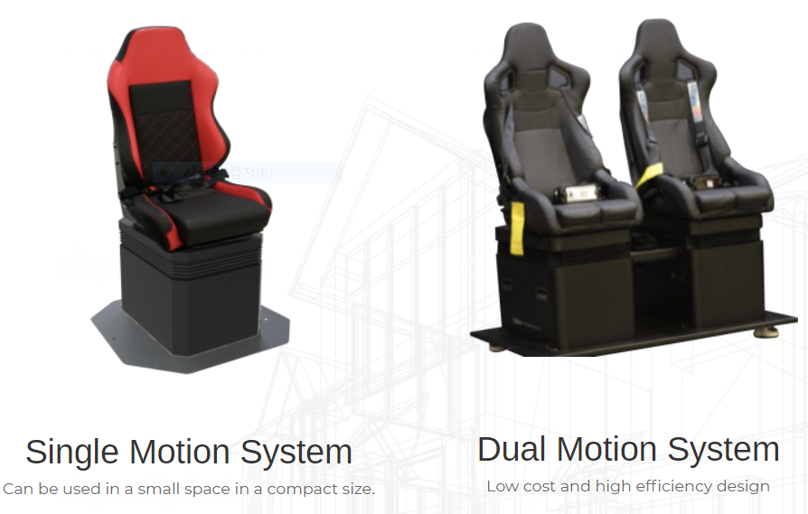
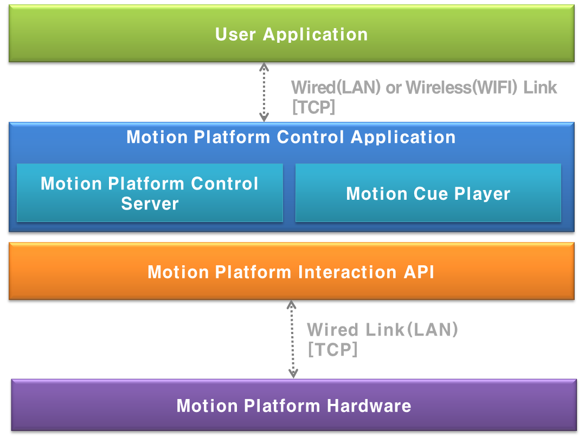
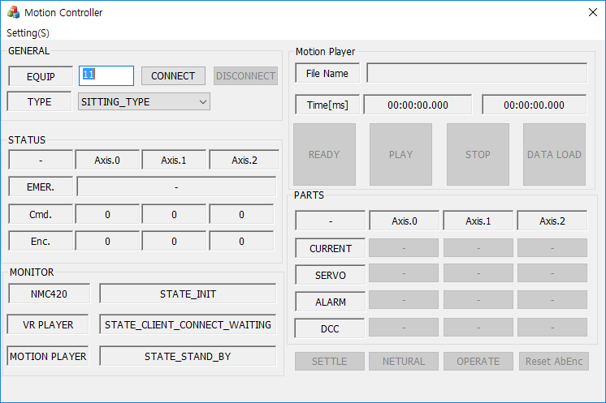

# VR 콘텐츠용 소형 모션 플랫폼\(3축\) 개발

## 개요

자체 개발한 VR 영상 컨텐츠 어플리케이션과 연동하여 동작하는 시트 타입 모션플랫폼\(3축\) 을 제어하는 어플리케이션 개발 프로젝트였다.

어플리케이션은 VR 컨텐츠 앱과 이더넷으로 연동할 수 있는 통신 부분, 모션플랫폼 상태 수신 및 동작 시키는 제어 부분, 큐\(Cue\) 에디터라는 프로그램에서 생성된 모션 데이터 파일을 로딩하고, 제어부분으로 데이터를 전달하는 큐\(Cue\) 플레이어 부분, 각 모듈의 상태를 모니터링하고, 사용자가 모션 데이터를 불러오거나, 모션플랫폼을 수동으로 제어할 수 있는 인터페이스를 제공하는 UI 부분으로 구성되어 있다.

## 세부내용

* 기간 : 16.04.18 ~ 17.02.17
* 사용언어 : C++\(MFC\)
* 사용 라이브러리 
  * CoreBase\(자체 제작한 이더넷 통신, 문자열 처리 라이브러리\)
  * STL\(데이터 처리\)
  * PAIX Controller SDK\(모션 플랫폼 제어 라이브러리\)

## 담당파트

**VR 영상 컨텐츠 앱용 모션 플랫폼 제어 통신 프로토콜 설계**

프로토콜 구조는 이전 회사에서 쓰던 프로토콜을 참조하여 설계하였다. 이는 이미 여러환경에서 검증을 거친 프로토콜 구조로 바로 적용이 가능했기 때문이다.

프로토콜 설계 초기에는 VR 어플리케이션에서 시작, 중지를 비롯하여 모션데이터로 전달할 수 있는 방향으로 구조를 잡았었다.

그러나 VR 어플리케이션이 유선 환경에서 동작하는 바이브나 오큘러스가 아닌 기어 VR과 같이 무선으로 연결된 디바이스와도 연동할 수 있어야 한다는 요구 사항이 있었다. 따라서 무선환경에서는 아무래도 통신 상태가 유선보다 불안하기 때문에 시작, 중지 커맨드만 남기고 나머지 커맨드들은 전부 제외 시켰다.

**VR 컨텐츠 앱과 연동을 위한 통신 모듈 개발**

VR 컨텐츠가 이더넷 타입으로 통신하는 방식이었기 때문에 프로그램도 이에 맞춰 동작하는 부분이 필요했다.

통신 부분은 신규 개발 대신 이전 회사에서 프로젝트 수행시 개발해놓은 모듈화된 코드를 활용하였다. 이미 이전에 여러 프로젝트에서 적용하여 사용중이라 안정성면에서도 검증은 되었음은 물론 개발기간도 단축시킬 수 있었기 때문이다.

이를 활용하여 현재 어플리케이션에 필요한 부분인 컨텐츠 앱과 설계한 프로토콜로 송수신하는 데이터 처리 및 UI 연동 부분만 추가로 구현하는 방향으로 작업을 진행하였다.

**큐\(Cue\) 플레이어 모듈 개발**

모션 데이터 파일을 로딩하여 제어 모듈에 전달할 수 있는 포멧으로 파싱하여 내부에 저장하였다가 VR 컨텐츠 앱으로부터 시작 커맨드 수신시 이에 맞춰 모션플랫폼을 동작시키는 데이터를 제어 모듈로 전달하는 모듈이다.

모션 데이터는 기존에 사내에서 사용중인 큐\(Cue\) 에디터라는 프로그램에서 생성된 텍스트 데이터 파일을 사용하였다.

**모션컨트롤러 제어 모듈 개발**

큐\(Cue\) 플레이어 모듈에서 전달받은 데이터로 실제로 모션플랫폼을 동작시키는 모듈이다.

모듈 구조 및 동작 프로세스는 이전에 개발했던 디바이스들과 유사했었기 때문에 당시 개발했었던 제어 모듈을 참조하여 설계, 구현하였다.

**UI 부분 개발**

어플리케이션이 컨텐츠 앱과 연동하여 안정적으로 실행되는 부분이 최우선이었다.

따라서 MFC 기본 컨트롤을 사용하여 UI 설계 및 구현은 최대한 공수가 들지 않는 방향으로 진행하였다.

## 어려웠던 점

**MFC 타이머의 성능 한계에 따른 어려움**

제어모듈에서 모션플랫폼을 동작시키기 위한 데이터 처리 부분 개발이 제일 어려웠었다.

VR 영상 컨텐츠와 모션플랫폼의 싱크가 최우선이었는데 기존의 MFC 타이머로는 해결할 수 없었기 때문이다.

특히 컨텐츠 길이가 길수록 싱크가 어긋나는 현상이 더 심했었다

타이머 간격을 늘리고, 데이터를 띄엄띄엄 전달하는 방법으로 싱크가 어긋나는 문제는 해결할 수 있었다.

하지만 데이터 입력 간격이 늘어나다보니, 모션플랫폼이 부자연스럽게 움직여 탑승자가 영상 컨텐츠에 집중하지 못하는 문제가 발생하였다.

해결 방안을 모색하던중, 구글 검색을 통해 멀티미디어 타이머를 사용하면, 타이머 최소 주기가 15ms인 MFC 타이머보다 더 짧게 설정하여 사용할 수 있다는 것을 알게 되었다.

해당 처리 부분을 멀티미디어 타이머를 사용하여 다시 구현한 결과, 모션플랫폼의 부자연스러운 움직임과 영상 컨텐츠와의 어긋났던 싱크. 두가지 문제를 한꺼번에 해결할 수 있었다.

## 정리

여느 프로젝트처럼 새로운 개발 기술을 적용하기보다는 이전 프로젝트들 통해 익혔던 개발 경험 및 네트워크 통신, 파일 입출력, 디바이스 제어 등 현재 보유한 기술들을 활용했던 프로젝트였다.

이를 통해 현재 개발 기술들에 대한 수준을 파악하고, 개선할 부분을 확인할 수 있었기 때문에 개인적으로는 큰 의미가 있었던 프로젝트였다.

## 스크린샷

