# AI 기반 멀티뷰 미디어 편집 솔루션 VERTIGO 기능 개선 개발

## 개요

VERTIGO는 세로형 영상. 소위 말하는 세로 직캠 영상 제작에 특화된 AI 기반 멀티뷰 미디어 편집 솔루션이다.

그동안 세로형 영상 제작을 하기 위해서는 본 영상 촬영과 별개로 추가로 인력을 투입하여 찍거나, 프리미어 같은 영상 편집툴을 이용하여 가로형 영상에서 크롭하는 방식을 주로 사용하였다.

그런데 전자의 경우 인물별 동선에 따라 카메라간 간섭이 발생하다 보니 기대만큼 영상 결과물이 나오지 않을 때가 많았고, 후자의 경우 10명 이상 대규모 인원으로 구성된 아이돌에 대한 세로형 직캠 영상 제작시 인물 수에 비례하여 편집시간이 소요됨은 물론 움직이는 피사체를 편집하는 것도 또한 용이하지 않는 등의 문제가 많았다.

VERTIGO는 보다 효율적이고 퀄리티 높은 세로형 영상 제작이 가능하도록 KBS 기술 연구소\(이하 연구소\)에서 개발한 얼굴 인식과 클러스터링 기술이 Face AI 엔진이 탑재된 멀티뷰 미디어 편집 솔루션으로, 현재\(21년 3월 1일 기준\) 유튜브 KBS Kpop 채널에서 서비스중인 뮤직뱅크 세로 직캠 컨텐츠인 K-FANCAM 제작에 적극 활용중에 있다



본 프로젝트는 연구소에서 발주한 기능 개선건으로, 기존에 연구소에서 사용중인 2.0 버전에 대한 UI/UX 개선과 함께 고속 렌더링 모듈 연동을 통한 멀티 GPU 환경에서 렌더링 속도 향상, 세로 직캠 영상 렌더링 중 편집 작업 기능과 Face AI 엔진 분석 데이터 처리 속도 향상 등 어플리케이션 성능 향상에 초점을 맞춰 진행되었다.

## 세부내용

* 기간 : 2020.06.08 ~ 2020.12.07
* 개발 언어 : NSIS, C++, C\#\(Unity\)
* 사용 라이브러리 및 에셋
  * AVPro Video\(영상 재생 에셋\)
  * VLC Unity\(영상 재생 에셋\)
  * FileBrowserPro\(파일 처리 에셋\)
  * SoftMaskForUGUI\(스크린 마스킹 효과 에셋\)
  * MediaInfo\(영상 코덱, 해상도 등 영상 정보  확인 라이브러리\)
  * Sentinel LDK\(Thales社 USB 동글 라이센스 라이브러리\)

## **담당 파트**

### **GPU 가속 지원 고속 멀티 렌더링 모듈 연동 컨트롤러 개발**

기존 프로그램에서 사용중인 렌더링 모듈은 GPU 가속 렌더링을 지원하지 않아 3분 가량 되는 8K 해상도의 60프레임 영상에서 HD 해상도의 세로 직캠 영상 한편을 만드는데 짧게는 15분에서 길게는 20분 가량 걸리곤 했었다.

그러다 보니 회당 평균 10편 이상 세로 직캠 영상물 만들어야 하는 뮤직뱅크 작업 환경에서 영상 편집을 제외한 영상 렌더링에만 4시간 가까이 소요 되고 있었다.

따라서 본 프로젝트에서는 연구소에서 외주 의뢰를 통해 개발한 GPU 가속이 지원되는 고속 렌더링 라이브러리를 전달 받아 이와 연동하여 동작하는 컨트롤러를 설계, 개발하였다.

해당 모듈에서 Restful API로 연동하는 서버 모드와 C++ DLL 로 동작하는 스탠드 얼론 모드 및 시스템에 탑재된 GPU 디바이스를 선택하여 동작이 가능 했기 때문에 컨트롤러 또한 두 가지 모드를 전부 지원하고, 구동되는 시스템 환경에 설치된 GPU 디바이스 갯수에 따라 병렬 렌더링을 수행할 수 있는 구조로 설계, 개발하였다.

그 결과 동일 영상에 대하여 렌더링시 기존에 비해 작업시간이 절반이상 줄어 들었음은 물론 사용자가 본인이 작업 환경에 맞춰 렌더링 모드를 유연하게 선택하여 사용할 수 있게 되었다.

또한 컨트롤러에서 제공하는 멀티 렌더링 기능을 통해 작업 시스템의 GPU 구성에 따라 렌더링 작업 시간을 비약적으로 단축 시킬 수 있게 되었다.

### **소프트웨어 복사 방지를 위한 라이센스 검증 컨트롤러 개발**

소프트웨어 복사 방지를 위해 프로젝트 초기에는 라이센스 서버에 로그인하여 동작하는 웹인증 방식을 고려했었으나, 작업 영상의 외부 유출 등을 막기 위해 폐쇄망에서 작업하는 경우가 대다수 였기 때문에 PC에 USB 동글키 장착 유무를 확인하는 하드웨어 방식을 선택하였다.

USB 동글 키는 Thales사의 Sentinel 솔루션을 사용하였는데, 이는 이전 회사에서 동일한 목적으로 사용해본 경험이 있었기 때문에 다른 솔루션에 비해 신속하게 개발할 수 있는 장점이 있었기 때문이다.

### **영상 컨텐츠 편집 화면 디자인 개선 및 기능 고도화**

키프레임 편집은 세로 직캠 제작하는 데 있어 가장 주요한 기능이다 보니 개선에 대한 요구사항이 다른 어떤 부분보다도 많았던 파트였다.

기존 버전에서 키프레임 이동 및 단일 키프레임에 대한 삭제만 지원했었다.

또한 보다 신속한 컨텐츠 제작을 위해 작업 전에 Face AI 엔진을 이용하여 키프레임 데이터를 미리 생성해 놓는 경우가 많았는데, 이 때 엔진에서 유사한 키프레임들은 클러스터라는 단위로 묶어 처리하고 있었다.

얼굴 분석 과정에서 Face AI 엔진에서 동일한 인물임에도 불구하고 얼굴 각도에 따라 다른 사람으로 인식하여 각기 다른 클러스터로 묶은 경우도 있었기 때문에 병합 과정이 필요했었다.

그런데 기존 버전에서는 화면상에 현재 선택된 클러스터의 키프레임들 외에는 보이지 않았기 때문에 AI 엔진 분석을 통해 생성된 다른 클러스터들의 키프레임 데이터들을 볼 수가 없었다.

따라서 작업자가 클러스터간 데이터 병합을 하기 위해서는 우측에 클러스터 뷰 메뉴를 이용해 화면을 전환해가며 생성된 클러스터들을 확인해가며 작업을 수행하여 했다.

그러다 보니 Face AI 엔진 데이터를 사용하여 컨텐츠 제작시 작업자가 수동으로 제작할 때보다 시간이 더 오래 걸려, 엔진 데이터의 활용도가 많이 떨어졌었다.

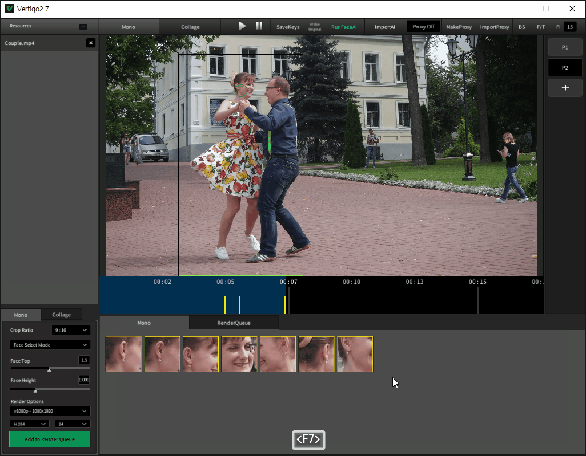

본 프로젝트에서는 한 화면에서 각 클러스터들을 볼 수 있도록 배치하여 전체 클러스터의 데이터를 한 눈에 확인 가능하도록 UI 를 개선하여, 보다 적극적으로 Face AI 엔진 데이터를 활용할 수 있도록 하였다

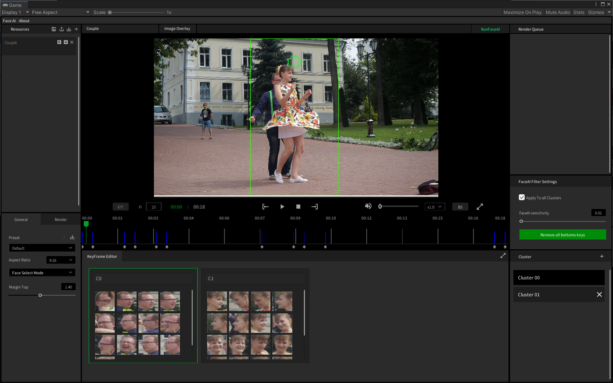

키프레임 편집 기능 또한 단일/부분/전체 선택은 물론 단축키 및 마우스 드래그엔 드랍을 통한 복사/이동 기능 지원 등 기존 프로그램에 비해 사용자 편의성을 대폭 강화하였다.

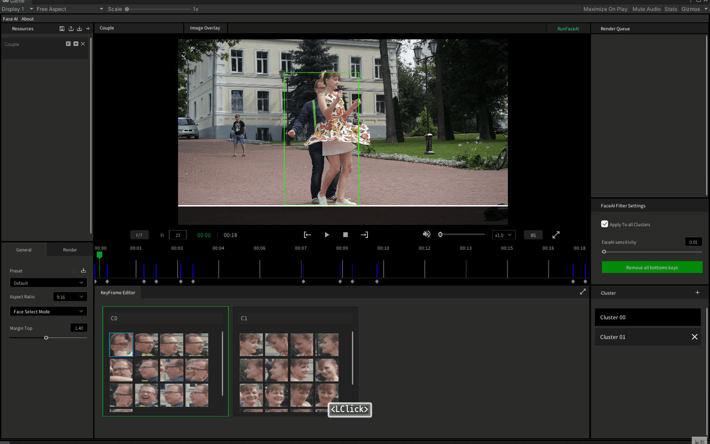

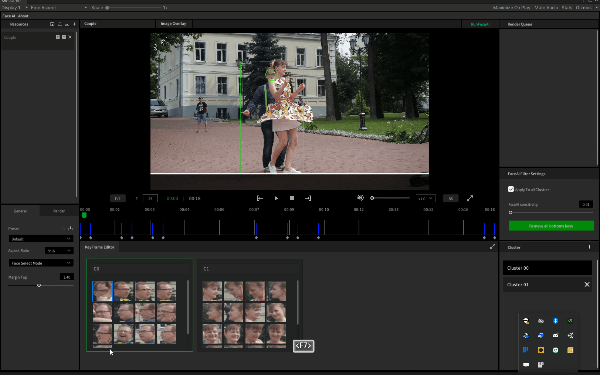

### **커맨드 패턴 기반 Undo/ Redo 기능 개발**

작업자들이 기존 버전을 사용하면서 불편하다고 느꼈던 점 중 하나는 현재 선택한 키프레임 데이터를 실수로 삭제했다던가 혹은 서로 다른 클러스터를 병합 했을 때 이를 복원할 방법이 없었다는 것이였다.

따라서 본 프로젝트에서는 사용자가 현재 수행한 작업에 대하여 이를 되돌릴수 있도록 Undo/ Redo 기능을 개발하였다.

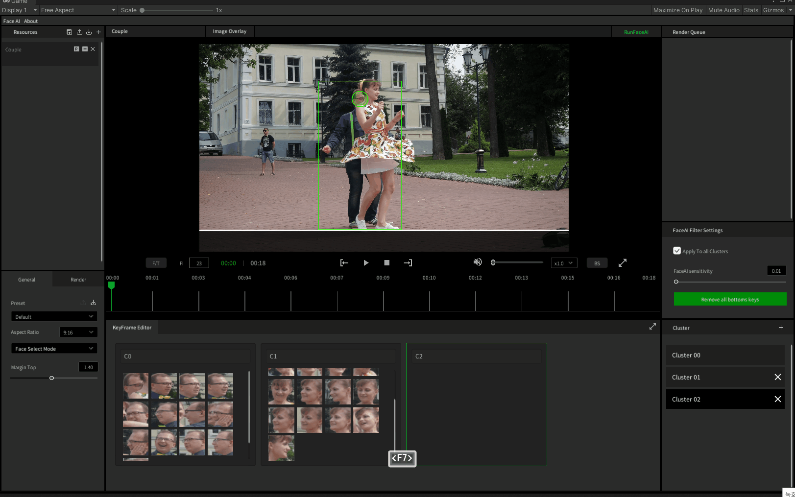

Undo / Redo 기능 구현하는데는 보통 메멘토 패턴과 커맨드 패턴이 많이 쓰이는데 후자쪽이 자료가 더 많아 기능 개발하는데 있어 보다 수월할 것으로 판단하여 수월할 것으로 보여 커맨드 패턴 기반으로 개발하였다. 또한 Undo / Redo 커맨드를 처리하는 컨트롤러는 어플리케이션 실행중 단 하나의 인스턴스만 존재해야 하는 관계로 싱글턴 패턴을 사용하였다.

### **로고 이미지 오버레이 기능 개발**

유튜브에 업로드시 제작한 컨텐츠의 영상 하단 중앙에 로고를 삽입하는데, 이전까지는 어플리케이션에서 작업한 영상을 렌더링 한 후 프리미어 같은 영상 편집툴을 이용하여 로고를 삽입 후 다시 랜더링 하고 있었다.

이번 프로젝트에서는 작업 영상에 삽입한 이미지의 사이즈 및 위치 조절이 가능한 이미지 오버레이 기능을 제공하여 영상 편집툴 사용 없이 바로 결과 영상물을 만들 수 있도록 하였다.

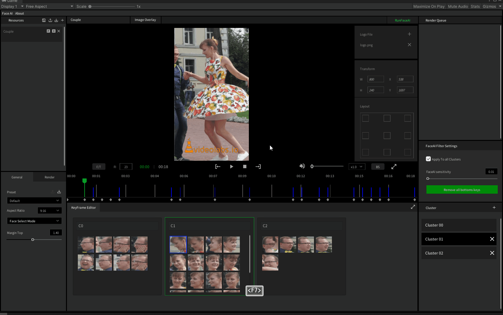

또한 해당 화면에서 추가한 키프레임들을 기반으로 한 영상 재생 기능도 구현하여 작업한 결과물을 렌더링 전 미리 확인할 수 있는 프리뷰 기능도 기능도 제공하였다.

### **어플리케이션 UI/UX 개선**

어플리케이션 화면에도 큰 변화가 있었다. 기존 화면의 경우 각 패널이나 컨트롤들의 색상이라던가 혹은 컨트롤들의 배치가 그때 그때 필요에 의해 추가되다 보니 다소 산만한 감이 없잖아 있었다.

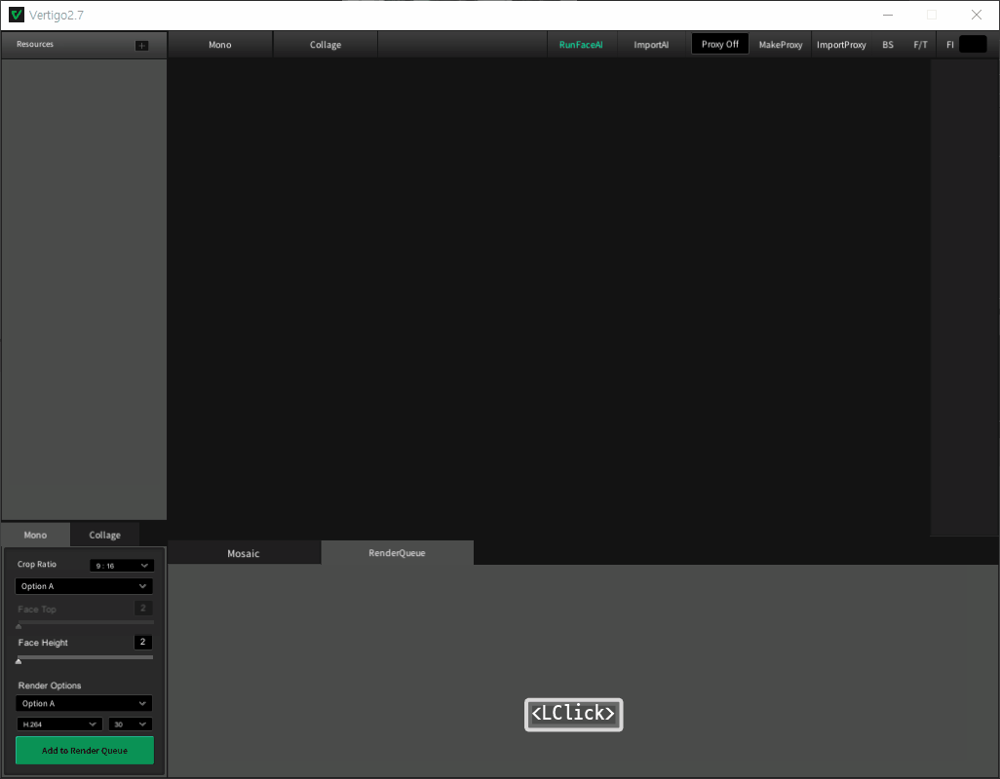

이번 프로젝트에서는 내부 디자이너의 도움을 받아 전체적인 색상 톤을 통일하고 패널 및 컨트롤들도 새로 디자인한 리소스들로 교체하였다.

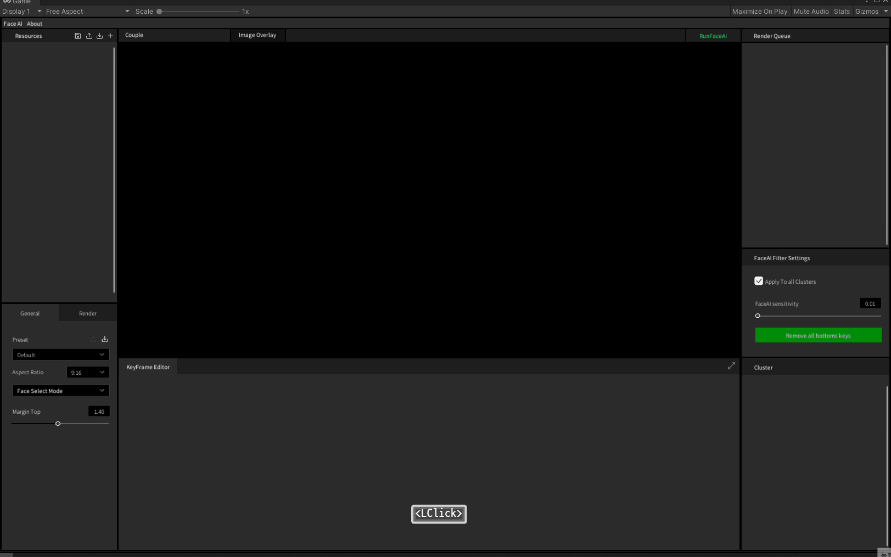

화면 상단에 배치되어 있던 각종 컨트롤들은 사용 목적에 맞게 재배치 되었다. 그 결과 영상 관련 컨트롤들은 영상 재생 화면 하단에, Face AI 엔진 실행 등 그 외 컨트롤들은 화면 상단에 새로 추가된 메뉴 패널로 옮겨졌다.

### **커스텀 다이얼로그 UI 컨트롤 개발**

어플리케이션에서 사용자에게 작업 완료 혹은 프로그레스 바를 이용한 진행 상황 알림 등 여러가지 상황을 보여주기 위한 메세지 다이얼로그가 필요했었다.

그런데 Unity 에서는 MFC 혹은 Winform 같이 프레임워크에서 기본적 모달 혹은 모달리스 다이얼로그 관련한 기능이 제공되지 않았기 때문에 UI 디자인은물론 내부 동작까지 직접 구현한 커스텀 다이얼로그 UI 컨트롤을 사용했다.

API 및 다이얼로그 동작 프로세스는 Winfrom 및 MFC를 참고하여 설계 및 구현 하였다.

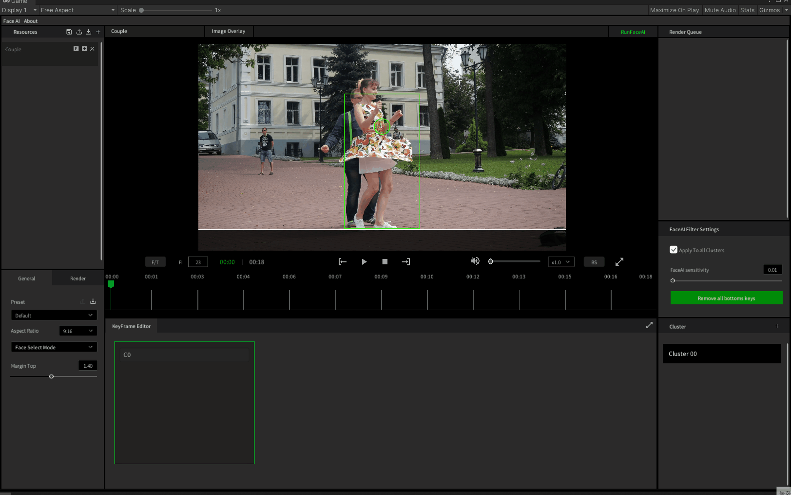

### **NSIS를 활용한 어플리케이션 인스톨 및 업데이트 등 패키지 유지 관리 환경 구축**

본 프로젝트에서 이전과 비교해서 개선된 사항을 하나 더 꼽자면 프로그램을 압축파일\(ZIP\)이 아닌 인스톨 파일 형태로 배포하게 되었다는 점이다.

특히 이번 프로젝트에서 개발한 프로그램 사용을 위해서는 HEVC 코덱 같이 부수적으로 설치되어야 하는 패키지들이 있었는데, 이를 기존 환경에 배포할 경우 사용자가 패키지들을 하나하나 수동으로 설치해야 하는 번거로움이 있었다.

따라서 보다 나은 배포방식에 대한 요구가 있었고, 이에 인스톨러 제작 솔루션을 이용한 실행가능한 인스톨 패키지 배포 방식을 도입하기로 결정하였다.

초기 검토 단계에서 Install Shield, InnoSetup, Wix, NSIS 등 여러가지 인스톨러 제작 솔루션중에서 NSIS 를 선택하였는데, 인스톨러 제작에 참고할 자료들이 풍부했을 뿐만 아니라 패키징 할 때 특수 압축 방식을 이용하여 오버헤드가 적고, 파일의 크기도 다른 솔루션에 비해 작아 대용량의 어플리케이션을 패키징 할 때 유리한 점도 있었기 때문이였다.

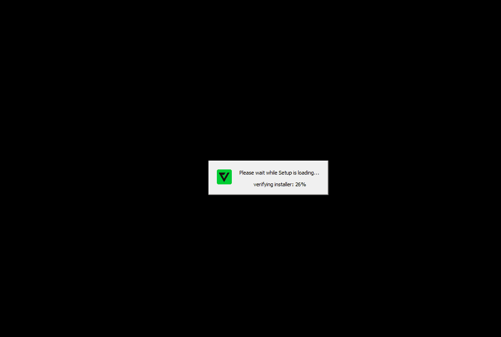

또한 외부에 구축된 업데이트 서버와 연동하여 카카오톡과 같이 실행시 신규 버전이 있는 경우 자동으로 업데이트 하는 기능도 구현하여, 신규 버전 릴리즈시 사용중인 장비에 따로 재설치 없이 항상 최신 버전을 유지할 수 있도록 환경을 구축할 수 있었다.

## 어려웠던 점

### **기능 개선 프로젝트였음에도 불구하고 원점에서부터 시작해야만 했던 프로젝트**

이번 프로젝트에서 가장 어려웠던 점은 기존 구현된 어플리케이션 소스를 활용하지 못하고 전부 새로 개발해야 했었던 부분이다.

특히 프로젝트 전체 수행기간이 6개월로, 기본 컨셉 및 동작 프로세스를 제외한 어플리케이션 전체 구조 설계부터 실제 구현까지 하기엔 그렇게 여유로운 일정은 절대 아니였다. 다만 연구소의 요구 사항을 반영하기엔 기존 어플리케이션 구조에선 불가능했었기 때문에 어쩔 수 없는 선택이였다.

따라서 촉박한 일정속에 새로 설계한 구조에 기존 어플리케이션에 포함된 모든 기능을 구현하면서 요구 사항에 대한 개발도 함께 진행해야 했었던 부분이 가장 힘들었던 부분이었다.

## 정리

앞서 기술한 대로 제한된 일정 안에서 기존 소스를 전부 버리고 신규 개발과 추가 개발. 두마리 토끼를 동시에 잡아야만 했었던 상황이 너무나도 힘들었던 프로젝트였다.

그렇지만 유니티 환경에서 어플리케이션 개발이나 Restful API를 활용한 개발 등 평소에 관심이 있었던 기술이나 분야에 대한 경험을 쌓을 수 있었기 때문에 이제까지 가장 성취감이 높은 프로젝트로 기억에 남을 것 같다.

## 스크린샷

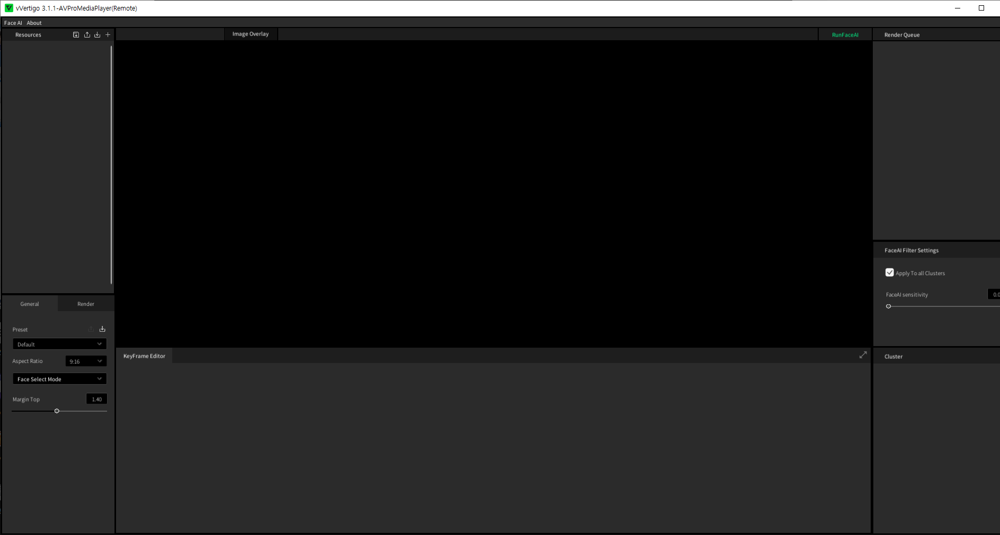

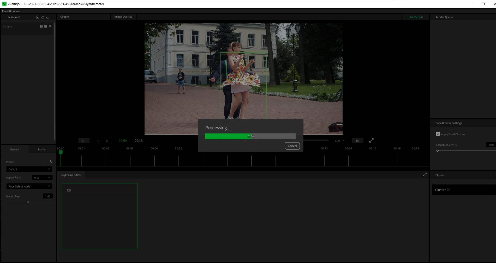

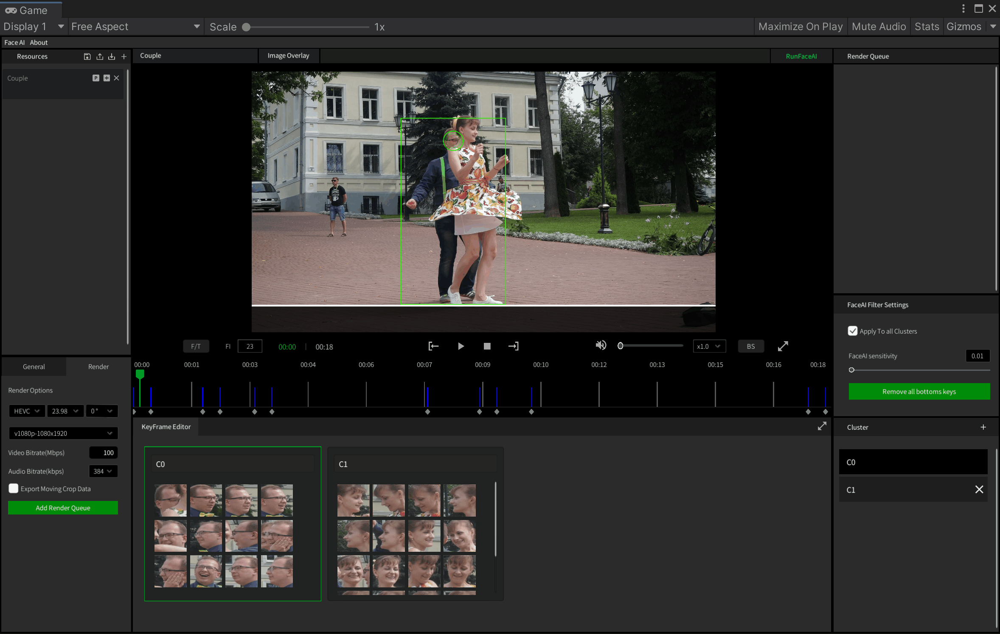

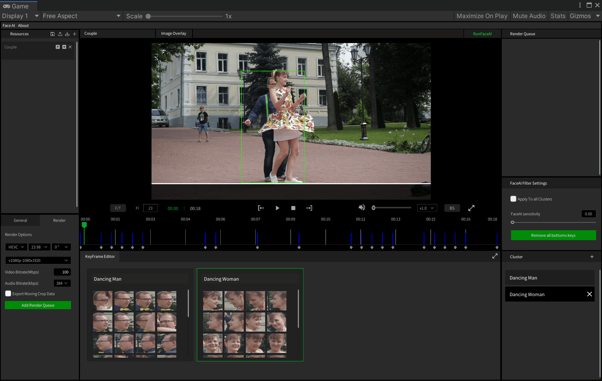

