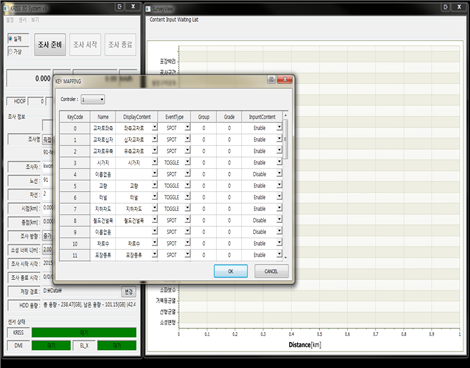
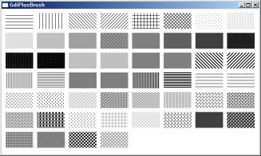
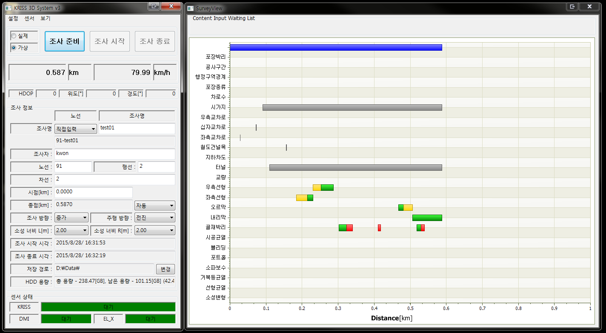

# 속성육안조사기 개발

## 개요

전국 도로의 안전 점검 업무를 담당하고 있는 한국건설기술연구원에서 의뢰로, 주행 중인 차량에서 조수석에 앉은 선탑자가 현재 도로의 현황 및 주변 시설물에 대한 컨텐츠를 신속하게 기록할 수 있는 장비 및 운용 어플리케이션 개발 프로젝트.

발주처에서는 목적에 부합하는 장비 및 소프트웨어를 이미 운용하고 있었으나, 여러 가지 이유로 현재 상황에 활용이 어려워 신규 개발로 진행하였다.

기록 장비는 시리얼 타입의 키입력 방식의 인터페이스 디바이스를 제작하여 납품하였는데, 이는 조작 가능한 디바이스 중 가장 친숙한 인터페이스의 장비로 사용자가 별다른 어려움 없이 바로 사용이 가능할 수 있기 때문이였다.

## 세부사항

* 기간: 14.05.28 ~ 15.01.09
* 사용언어 : C++\(MFC\)
* 사용라이브러리
  * RTCore\(사내 개발용  라이브러리\)
  * STL
  * CodeJock ToolkitPro\(커스텀 컨트롤, 그리드, 다이얼로그 UI 라이브러리\)
  * MFC GridCtrl\(커스텀 그리드 UI 라이브러리\)

## **담당파트**

### **커스터마이징 키 매핑 인터페이스 설계 및 개발**

기존의 장비와 함께 사용중인 어플리케이션의 경우 설정된 키의 동작 방법을 변경 할 수 있는 인터페이스가 제공되지 않았었다.

따라서 조사 환경이 바뀌어 입력해야 될 항목들이 바뀌는 경우에는 해당 장비 및 어플리케이션을 활용할 수 없다는 문제가 있었다.

이러한 문제를 해결하기 위해 조사 환경에 따라 사용자가 각 키들의 동작 설정을 커스터마이징 매핑이 가능한 설계 및 개발 하였다.

매핑 UI 인터페이스는 MFC 그리드 오픈 소스인 MFCGridCtrl 를 커스터마이징 하여 개발하였다.

매핑된 키 데이터 설정 데이터는 TinyXML 라이브러리를 사용하여 XML 파일로 관리하였다.

또한 매핑 UI 인터페이스를 이용하여 사용자가 원하는 대로 키배치를 하여 사용할 수 있었기 때문에 사용자 편의성도 높일 수 있었다.

### **입력 컨텐츠 디스플레이 컨트롤 개발**

기존 어플리케이션의 경우 사용자가 입력한 컨텐츠들을 가로바 형태를 그래프로 디스플레이 되는 커스텀 컨트롤을 사용하였다.

그런데 화면상에 각 컨텐츠들이 단책이나 해치\(Hatch\) 스타일로 디스플레이가 되었기 대문에, 여러 컨텐츠가 있는 화면의 경우 한눈에 구분하기 어렵다는 문제가 있었다.

신규 개발한 컨텐츠 디스플레이 컨트롤에서는 각 컨텐츠별로 명확하게 구분이 되도록 각각 색깔을 설정할 수 있는 인터페이스를 구현하였다.

디스플레이 컨트롤 개발시 Codejock UI 라이브러리의 차트 컨트롤을 커스터마이징 하여 사용하였다.

이는 회사에서 구매하여 사용중인 유일한 UI 라이브러리라는 이유도 있었지만, 차트 출력에 데이터 삽입 및 삭제 등의 기본적인 처리 및 화면 출력 등 디스플레이에 필요한 기본적인 기능들이 이미 구현되어 있었기 때문에 "바퀴를 새로 발명할 것 없이" 필요한 기능 개발로 바로 들어갈 수 있었기 때문이었다.

### **시리얼 인터페이스 키보드 디바이스 제어 모듈 개발**

어플리케이션에서 디바이스와 시리얼 통신로 제어하는 부분은 기존에 개발된 다른 프로젝트의 시리얼 통신 모듈을 활용하여 해당 프로젝트에서 디바이스와 어플리케이션간 데이터 통신 프로토콜 처리 부분 등 필요한 기능들만 추가로 개발하였다.

## 어려웠던점

### **키매핑 인터페이스의 높은 자유도로 인한 개발의 어려움**

발주처의 요구사항에 따라 상황에 따라 커스터마이징이 가능한 입력 인터페이스로 여러가지 고려해야될 사항들이 많아 설계 및 구현에 많은 어려움이 있었다.

예를 들자면, "Caps Lock" 같은 토글키처럼 ON/OFF 에 따라 다르게 동작하는 기능이라던가 동일한 그룹으로 설정된 키들끼리 연동하여 동작되도록 설정 가능한 그룹핑\(Grouping\) 기능 등 키 매핑에 필요한 여러가지 설정들을 조합하여 다양하게 동작 시킬 수 있었다.

이렇게 설정된 키들이 사용자의 키입력에 따라 다양한 상황이 연출될 수 있었기 때문에 이를 고려한 동작 시나리오를 작성하는 것도 일이었다.

하지만 이렇게 작성된 동작 시나리오는 내부 검증시 테스트 시나리오로 활용되어 어플리케이션 안정화에 많은 도움이 되었었다.

## 정리

해당 프로젝트를 수행하며 요구사항을 분석하여 UI 인터페이스를 설계하고 구현 경험을 쌓을 수 있었으며, 기존의 UI 컨트롤을 이용하여 커스터마이징된 새로운 UI 컨트롤을 개발 경험을 쌓을 수 있었다.

이를 통해 UI 개발 역량을 키울 수 있었음은, 물론 UI 컨트롤 개발에 대한 자신감도 생겼었다.

## 스크린샷

