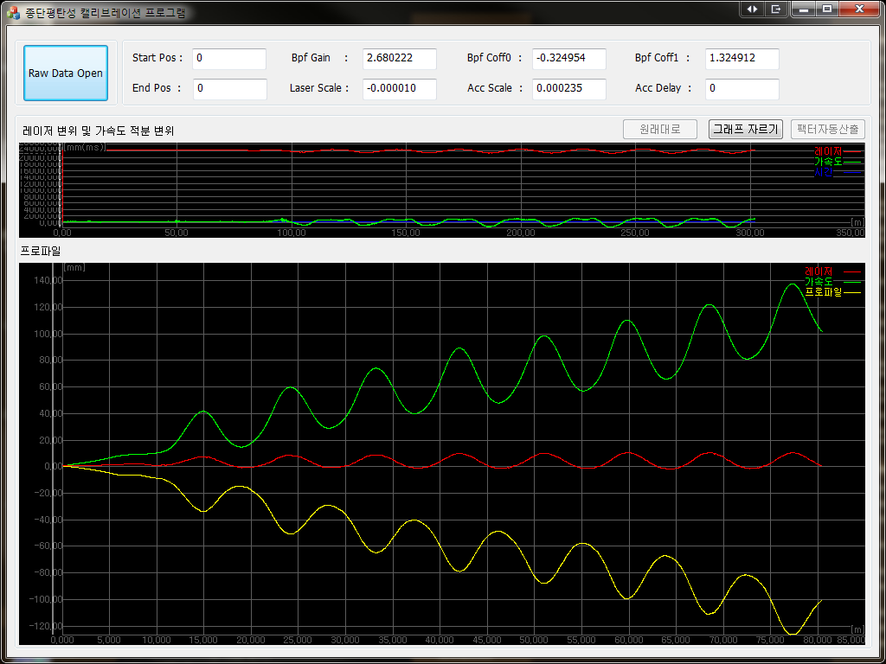
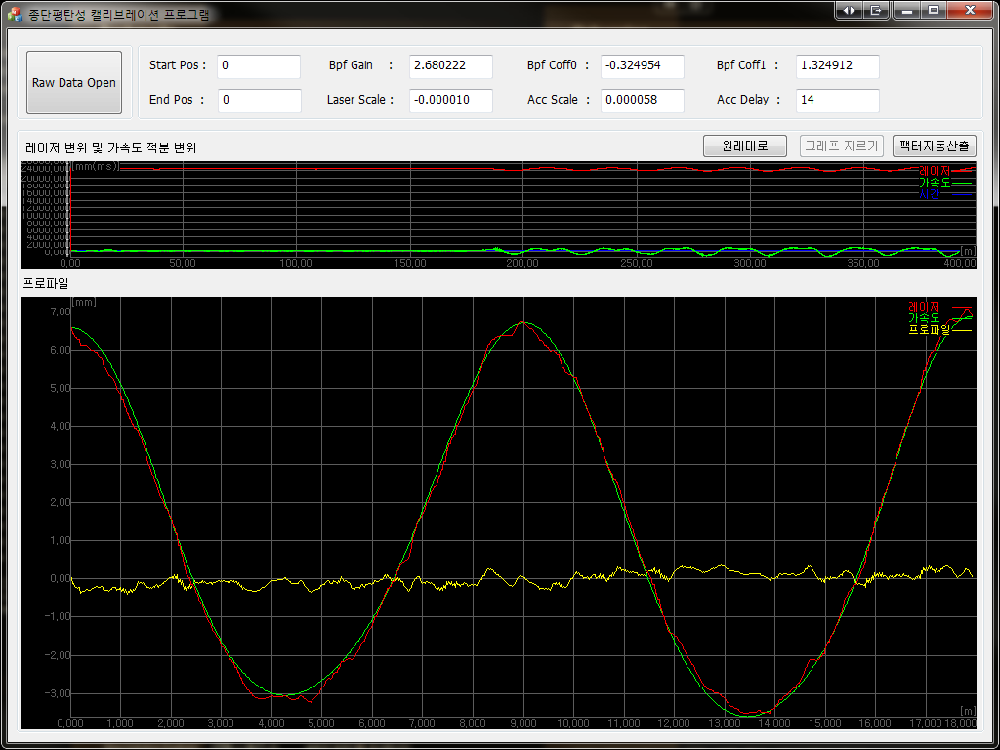

# 종단평탄성 캘리브레이터 개발

## 개요

로드텍에서는 노면 높이 측정용 하드웨어 모듈 내부에서 정확한 값 측정을 위해 적용할 보정 팩터를 산출하는 프로그램 유지보수 프로젝트.

기존 프로그램에서는 보정 팩터 최적값을 구하기 위해서는 사용자가 두 데이터의 차로 그려진 그래프가 얼마나 1차 직선에 근접하는 지 보고 직접 판단하는 방식이었다.

그러다 보니 팩터값 산출이 운용자의 주관적인 판단이 개입될 수 밖에 없었고,파라미터를 수동으로 변경, 적용하여 확인하는 방식이었기 때문에 계산시간도 오래걸렸다.

따라서 이를 보다 신속하고 정확한 보정값을 구하고자 하는 필요가 있었고 이에 따라 시작하게 된 내부 프로젝트였다.

## 세부사항

* 기간: 12.12.01 ~ 13.04.01
* 사용언어 : C++\(MFC\)
* 사용라이브러리  
  * RTCore\(사내 개발용 라이브러리\)
  * STL
  * GDI+

## **담당파트**

### **UI 인터페이스 개선**

알고리즘 에 적용되는 파라메터 입력 인터페이스 레이아웃 및 기능을 구현하였다.

알고리즘 계산시 구간 설정을 할 수 있는 인터페이스 및 지정된 구간을 화면에 디스플레이 할 수 있는 기능을 구현하였다.

### **보정 팩터 자동 산출 알고리즘 개발 및 적용**

우선 취득된 원시데이터에 노이즈가 많아 바로 알고리즘을 적용할 수 없어 우선 이동평균 필터를 사용하여 튀는 값들을 제거하였다.

자체 개발한 알고리즘에서는 가속도 센서를 이중적분한 높이값과 레이저 센서의 값을 이용하여 사용하고 있었다.

따라서 가속도 센서 데이터 값들은 추세선을 생성하여 x축 진행방향과 수평이 되도록 회전변환 시켰다.

이를 통해 레이저 센서의 데이터와 진행방향이 동일해짐에 따라 두 데이터 차의 합평균을 통해 유사도를 구할수 있었다.

최적 보정 팩터 산출은 내부에서 자동으로 파라메터 값을 변경해가면서 적용된 알고리즘을 통해 나온 유사도가 가장 큰값이 나올 때까지로 하였다.

## 어려웠던 점

### **개발 역량에 한계에 따른 제한적인 기능 구현**

해당 프로젝트에서 수행했던 업무중 UI 구현이 가장 어려웠었다.

해당 프로젝트 수행 당시 MFC 프레임워크 상에서 리소스 뷰를 사용하여 레이아웃 수정을 한다던가 Device Context를 이용한 화면 출력 등 기능 구현을 하기엔 개발 역량이 많이 부족했었기 때문이다.

그래서 프로젝트 킥오프시 계산구간을 프로그램 화면상의 그래프에서 마우스로 드래그하여 지정할 수 있는 인터페이스로 해달라는 요구사항이 있었지만 당시 개발 역량의 한계로 에디터 컨트롤로 입력하는 방식으로 우회하여 구현하였었다.

## 정리

내부 프로세스 구현 위주로 진행했었던 첫번째 프로젝트와 달리 리소스 뷰를 통한 어플리케이션 레이아웃 수정 같은 부분을 주로 했었기 때문에 UI 개발 경험을 많이 쌓을 수 있는 프로젝트였다.

## 스크린샷

