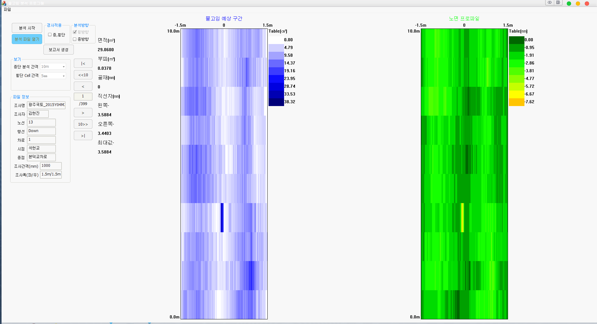

# 고속소성변형 분석기 개발

## 개요

로드텍 입사 후 담당했던 첫 번째 프로젝트.

이전 프로젝트에서 개발한 어플리케이션 유지보수 프로젝트였다.

조사장비에서 취득한 노면 높이 데이터에서 도로명 및 조사자명 같은 일반 정보와 노면 데이터를 기반으로 예상되는 노면의 물고임을 시각화 해서 보여주는 일종의 이미지 뷰어 같은 어플리케이션이었다.

## 세부사항

* 기간: 2012.08,06 ~ 2012.12.28
* 사용언어 : C++\(MFC\)
* 사용라이브러리
  * RTCore\(사내 개발용 라이브러리\)
  * STL

## **담당파트**

### **물고임 산출 알고리즘 개발**

미분시 변곡점 구하면 해당 지점의 고/저 점 판별이 가능하다는 점을 이용하여 알고리즘을 개발하였다.

1. 횡방향으로 각 점들을 미분하여 해당 구간의 고점과 위치를  리스트에 저장
2. 좌우로 나눌 기준이 될 가장 높은 고점을 해당 리스트 찾음
3. 찾은 점을 기준으로 좌측부터 좌측에서 그 다음 높은 고점을 탐색
4. 두 점 사이에 속한 고점들은 전부 잠기므로 무시하고, 구간 사이의 물고임을 계산
5. 첫번째 고점에 도달할때까지 3-4번을 반복
6. 그 다음 우측에 대해서도 동일하게 반복하여 해당 구간의 횡방향 전체 물고임을 계산 
7. 각 구간의 횡방향 물고임 계산이 끝났으면 종방향에 대해서도 동일한 방식으로 계산

### **물고임 산출 알고리즘 적용**

알고리즘 구현에는 STL의 Vector와 Tuple 자료형을 사용하였다.

고점 탐색은 std::find\_if 같은 함수를 사용하면 쉽게 구할 수 있지만, 당시는 STL에 그런 함수가 있다는 것도 몰랐었기 때문에 for 루프를 이용한 순차 탐색으로 구했었다.

### **결과 보고서 파일 출력 기능 개발**

화면상 보이는 조사명이나 조사자 같은 파일 정보와 설정한 간격 기준으로 계산된 면적, 부피 등의 분석 결과를 CSV 파일로 생성하는 기능을 개발하였다.

## 어려웠던 부분

### **첫 프로젝트**

프로젝트 투입 당시 C++ 은 대학교 교양수업 때 printf와 for을 이용한 간단한 코드 정도만 작성해 본 정도였다.

더욱이 사내에서 사용중인 개발툴인 Visual Studio나 MFC 프레임워크에 대한 사용경험은 전무했었다.

따라서 기능 코드가 어떻게 동작하는지 분석조차 할 수 없는 상황이었다.

다행히 팀 내 선임 개발자들로부터 개발툴 사용법이라던가 코드 분석 및 작성에 대하여 여러가지 도움을 받을 수 있었다.

개인적으로도 프로젝트 수행에 부족한 개발 역량을 채우는데도 게을리 하지 않았다. 퇴근 후나 주말 등 여가시간을 이용하여 C++ 및 MFC 개발 서적을 통해 역량 개발에 힘을 썼고, 첫 프로젝트를 무사히 성공적으로 마칠 수 있었다.

## 정리

작성일 기준\(19.03.01\)으로 보았을 때 개선할 부분이 많이 보였던 프로젝트가 때문에, 지금 생각하면 여러모로 많은 아쉬움이 남는다.

그 중에 가장 큰 두가지를 꼽아보자면 다음과 같다.

첫번째로 프로젝트 코드 구조 부분이다.

데이터 파일 입출력 및 데이터 분석 코드들이 전부 화면 출력 및 조작쪽 코드와 함께 구현되어 있어서 유지보수가 어려웠다는 점이다.

따라서 지금 이 프로젝트 유지보수를 맡았더라면, 모듈화를 위해 먼저 UI쪽 코드와 파일 처리 및 물고임 분석 쪽 기능 부분을 분리하는 작업부터 진행했을 것 같다.

두번째로 데이터 처리를 위한 속도 부분이다.

데이터 분석을 위해 횡방향, 종방향 순으로 계산시 단일 쓰레드를 사용하고 있었다.

예를 들어 20km 구간을 분석한다고 하면, 총 6천만개의 데이터를 횡방향 계산을 위해 3천개의 데이터를 2만번, 다시 종방향 분석을 위해 2만개의 데이터를 3천번 탐색해야했다.

따라서 구간 거리가 긴 데이터일 수록 분석 시간이 오래걸린다는 단점이 있었다.

당시 쓰레드에 대한 개념 조차 없었기 때문에, 기존 개발자가 구현해놓은 프로세스에 개발한 알고리즘만 적용하여 구현했었다.

만약 지금이었다면, 각 구간의 횡방향 데이터는 서로 독립적이므로 종방향 10m 씩 나눠서 다수의 쓰레드를 사용하여 분석 시간을 좀 더 단축 시킬 수 있지 않았을까 하는 생각이 든다.

## 스크린샷

