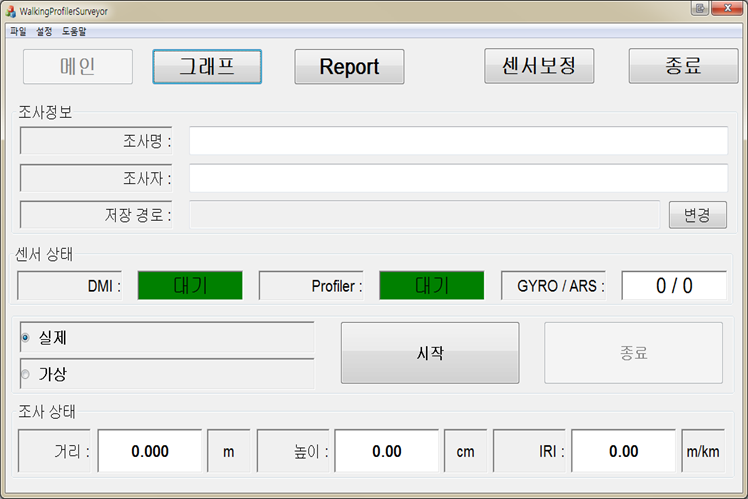
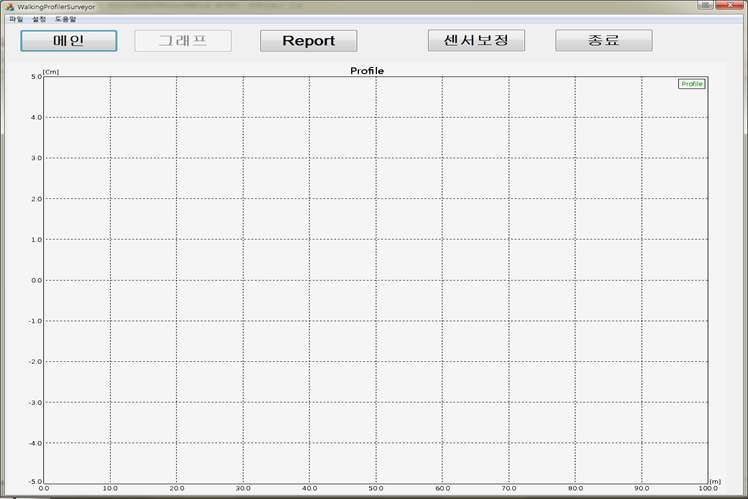

# 도로평탄성조사기 개발

## 개요

한국건설품질시험원 의뢰로 Supro社의 2륜형 도로평탄성 측정 장비인 Surpro 4000 을 레퍼런스로 한 장비 제작 및 운용 어플리케이션 개발 프로젝트.

Surpro의 경우 손잡이 상단에 부착된 LCD 디스플레이와 물리 버튼으로 구성된 컨트롤 패널로 장비 조작이 가능하였다.

하지만 프로젝트에서는 장비 컨트롤 패널을 LCD 패널이 아닌 윈도우 타블렛을 채택하여 사용하였다.

이는 데스크탑의 윈도우 환경에서 개발한 어플리케이션을 그대로 사용할 수 있음은 물론 발주처의 요청에 따라 화면 배치 및 기능 추가 등을 자유롭게 할 수 있기 때문이었다.

## 세부사항

* 기간: 13.12.02 ~ 14.05.23
* 사용언어 : C++\(MFC\)
* 사용 라이브러리 
  * RTCore\(사내 개발용  라이브러리\)
  * STL
  * GDI+

## **담당파트**

### **UI 인터페이스 설계 및 구성**

UI 설계시 조사중인 장비로부터 취득되는 데이터를 수치 정보로 디스플레이 하는 부분 외에 순간순간의 데이터를 시각적으로 보여주는 그래프 컨트롤을 추가로 배치하기로 하였다.

이는 조사중인 도로의 평탄성 경향을 시각적으로 파악이 가능하게 하여 사용자의 편의성을 높이려는 의도였다.

그런데 컨트롤 패널로 채택한 윈도우 타블렛 사이즈가 7인치였기 때문에 화면에 모든 인터페이스를 배치하기엔 사이즈 제한이 있었다.

따라서 화면을 두페이지로 구성하여 각 페이지에만 있어도 되는 부분과 공통적으로 필요한 부분으로 나누어 배치하였다.

그래서 취득 데이터를 수치 정보 디스플레이 부분과 그래프 디스플레이 부분이 분리되어 각각 다른 페이지에 배치되어는데, 그래프 디스플레이 부분에 수치 정보에서 확인가능한 대부분의 정보가 표시되었기 때문이었다.

### **UI와 각 모듈간 연동**

해당 장비는 거리를 측정하는 DMI와 노면높이를 측정하는 Profiler, 주행중 장비의 수평 기울임을 측정하는 Gyro 센서 모듈로 구성되어 있었다.

각 센서 모듈의 제어 부분과 해당 프로젝트에서 새로 개발한 UI 코드와 연동하는 작업을 맡아 진행하였다.

각 센서 모듈 제어 부분은 이전 프로젝트에서 개발한 코드를 가져와 사용하였다.

해당 부분 코드들은 이미 이전 프로젝트에서 검증을 통해 어느정도 안정화가 되었기 때문에 따로 테스트를 하지 않아도 되어 개발 기간을 단축할 수 있었다.

### **한글\(HWP\) 형식 보고서 파일 생성 모듈 개발**

프로그램에서 조사된 데이터를 "한글 Automation API"를 이용하여 한글\(HWP\)형식으로 보고서 파일을 생성하는 기능을 개발하였다.

프로젝트 발주처였던 한국건설품질시험원이한글\(HWP\) 문서를 주로 쓰는 관공서 산하 기관이었기 때문에 이러한 특수한 상황을 고려하여 개발을 진행하였다.

## 어려웠던 점

### **한글\(HWP\) 오토메이션 레퍼런스 부재**

프로젝트 초기에는 한글\(HWP\) 포맷 분석하여, 한글\(HWP 문서 자체를 바로 생성할 수 있는 기능을 개발하려고 했었는데, 한글 포멧 문서에 대한 기술 내용도 방대하여 분석하는데 오랜 시간이 걸릴 것으로 보였다.

더 빨리 개발할 수 있는 방법으로 한글에서 제공하는 "한글 Automation API"를 사용하는 것으로 개발 방향을 선회하였다.

하지만 "한글 Automation API"도 한글과 컴퓨터 홈페이지에서 제공되는 공식 문서만으로는 개발하는데 많이 부족하여 애를 많이 먹었다.

그런데 우연찮게 Excel에서 셀 이동이나 편집등의 조작을 "매크로 기록"을 사용 하면 VBA 코드로 생성되는 것처럼 한글 워드프로세서에서도 "스크립트 매크로" 기능이 이와 유사한 동작을 함을 발견하였다.

이를 이용하여 공식 문서상의 예제의 내용가 동일한 동작을 통해 얻어진 스크립트를 예제 코드와 비교, 분석하여 필요한 기능들 포함한 모듈을 개발할 수 있었다.

## 정리

해당 프로젝트를 수행하며 얻은 가장 큰 성과는 Automation 기능을 이용하면 프로그램에서 원하는 데로 내용을 작성하여 워드\(doc\) 나 한글\(HWP\) 문서로 만들 수 있다는 사실을 알았다는 점이다.

또한 한글\(HWP\) 보고서 생성 모듈 개발을 하면서 처음으로 모듈화 작업도 진행했었기 때문에 이에 대한 개발 경험도 할 수 있었다.

### 스크린샷

